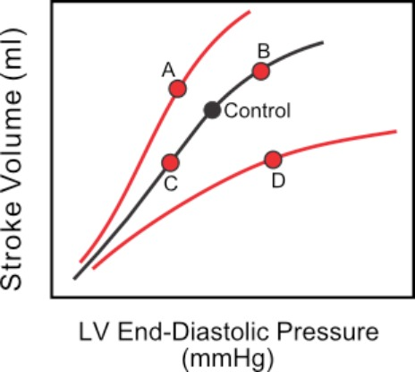
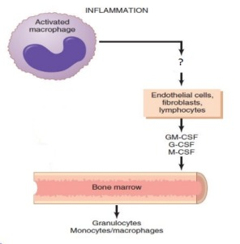

# CVS Theory · report dated 22 October 2021

The report carries 22 October 2021 and TUMS TestId 21231; this is the report date.

## Source and grading status

100 recovered question records / 100 expected in this fragment. 96 can be compared with a transcribed source mark. This is NOT an independently verified official medical answer key.

No new practice questions have been inserted. Original wording and choice order are retained as extracted; spelling/scan defects are not silently corrected. OCR or disputed items remain ungraded. A–D denote choice order when source labels are numeric.

## Source files

- [question-paper-with-marks.pdf](source.pdf) — originally `cardio.pdf`; SHA-256 `9d9f74b77b6b11cb4bee89e0c26f6065e0f550e39aaa6db3a705b1bd4046d09d`.

## Answer key / status

| Q | Supplied answer | Marking status |
|---|---|---|
| 1 | A | Source-key comparison only |
| 2 | D | Source-key comparison only |
| 3 | B | Source-key comparison only |
| 4 | B | Source-key comparison only |
| 5 | B | Source-key comparison only |
| 6 | D | Source-key comparison only |
| 7 | A | Source-key comparison only |
| 8 | D | Source-key comparison only |
| 9 | C | Ungraded |
| 10 | B | Ungraded |
| 11 | D | Source-key comparison only |
| 12 | B | Source-key comparison only |
| 13 | C | Source-key comparison only |
| 14 | C | Source-key comparison only |
| 15 | D | Source-key comparison only |
| 16 | B | Source-key comparison only |
| 17 | A | Source-key comparison only |
| 18 | D | Source-key comparison only |
| 19 | B | Source-key comparison only |
| 20 | D | Source-key comparison only |
| 21 | C | Source-key comparison only |
| 22 | B | Source-key comparison only |
| 23 | B | Source-key comparison only |
| 24 | A | Source-key comparison only |
| 25 | B | Source-key comparison only |
| 26 | C | Source-key comparison only |
| 27 | C | Source-key comparison only |
| 28 | B | Source-key comparison only |
| 29 | A | Source-key comparison only |
| 30 | D | Source-key comparison only |
| 31 | A | Source-key comparison only |
| 32 | C | Source-key comparison only |
| 33 | C | Source-key comparison only |
| 34 | C | Source-key comparison only |
| 35 | D | Source-key comparison only |
| 36 | C | Source-key comparison only |
| 37 | A | Source-key comparison only |
| 38 | C | Source-key comparison only |
| 39 | B | Source-key comparison only |
| 40 | B | Source-key comparison only |
| 41 | D | Source-key comparison only |
| 42 | A | Source-key comparison only |
| 43 | B | Source-key comparison only |
| 44 | B | Source-key comparison only |
| 45 | D | Source-key comparison only |
| 46 | A | Source-key comparison only |
| 47 | D | Source-key comparison only |
| 48 | A | Source-key comparison only |
| 49 | C | Source-key comparison only |
| 50 | D | Source-key comparison only |
| 51 | C | Source-key comparison only |
| 52 | B | Source-key comparison only |
| 53 | D | Source-key comparison only |
| 54 | C | Source-key comparison only |
| 55 | B | Source-key comparison only |
| 56 | B | Source-key comparison only |
| 57 | D | Source-key comparison only |
| 58 | B | Source-key comparison only |
| 59 | B | Source-key comparison only |
| 60 | D | Source-key comparison only |
| 61 | C | Source-key comparison only |
| 62 | A | Source-key comparison only |
| 63 | D | Source-key comparison only |
| 64 | B | Source-key comparison only |
| 65 | D | Ungraded |
| 66 | D | Source-key comparison only |
| 67 | C | Ungraded |
| 68 | D | Source-key comparison only |
| 69 | A | Source-key comparison only |
| 70 | B | Source-key comparison only |
| 71 | A | Source-key comparison only |
| 72 | D | Source-key comparison only |
| 73 | D | Source-key comparison only |
| 74 | B | Source-key comparison only |
| 75 | D | Source-key comparison only |
| 76 | A | Source-key comparison only |
| 77 | B | Source-key comparison only |
| 78 | C | Source-key comparison only |
| 79 | A | Source-key comparison only |
| 80 | D | Source-key comparison only |
| 81 | C | Source-key comparison only |
| 82 | B | Source-key comparison only |
| 83 | B | Source-key comparison only |
| 84 | C | Source-key comparison only |
| 85 | A | Source-key comparison only |
| 86 | D | Source-key comparison only |
| 87 | A | Source-key comparison only |
| 88 | B | Source-key comparison only |
| 89 | A | Source-key comparison only |
| 90 | C | Source-key comparison only |
| 91 | D | Source-key comparison only |
| 92 | A | Source-key comparison only |
| 93 | C | Source-key comparison only |
| 94 | C | Source-key comparison only |
| 95 | D | Source-key comparison only |
| 96 | B | Source-key comparison only |
| 97 | D | Source-key comparison only |
| 98 | B | Source-key comparison only |
| 99 | D | Source-key comparison only |
| 100 | B | Source-key comparison only |

## Questions

### Q1 · source page 1

All cardiac valves are normally closed during which of the following phases of the cardiac cycle?

A. isovolumetric relaxation
B. atrial contraction
C. systolic ejection
D. ventricular filling

**Answer:** A. Provided source mark only; not independently verified as the medically correct answer or as an official university key.

### Q2 · source page 1

The T wave of the electrocardiogram begins to occur during

A. early diastole
B. isovolumetric relaxation
C. isovolumetric contraction
D. systolic ejection

**Answer:** D. Provided source mark only; not independently verified as the medically correct answer or as an official university key.

### Q3 · source page 1

Ventricular muscle is isolated and set up in an apparatus to study shortening contractions. At a fixed preload and inotropic state, decreasing the afterload on the ventricular muscle fiber

A. increases active tension development by the fiber
B. increases the rate of fiber shortening
C. decreases the amount of fiber shortening during contraction
D. increases Vmax when shortening velocity is plotted against afterload

**Answer:** B. Provided source mark only; not independently verified as the medically correct answer or as an official university key.

### Q4 · source page 1

During the process of cardiac excitation-contraction coupling

A. calcium enters the cell through ryanodine receptors
B. calcium enters the cell and stimulates calcium release by the sarcoplasmic reticulum
C. ATP is required for contraction but not relaxation
D. ATPase bound to actin hydrolyzes ATP to supply energy

**Answer:** B. Provided source mark only; not independently verified as the medically correct answer or as an official university key.

### Q5 · source page 1

The "C" wave of atrial pressure curve is due to

A. atrial diastole
B. ventricular systole
C. ventricular diastole
D. atrial systole

**Answer:** B. Provided source mark only; not independently verified as the medically correct answer or as an official university key.

### Q6 · source page 2

Calcium is transported out of the cardiac cell by 3. Phase 4 of SA nodal action potentials is generated in part by

A. the Ca ++ -ATPase pump directly coupled to the Na /K -ATPase pump + +
B. passive diffusion down its concentration gradient
C. the Na /K -ATPase pump + +
D. the Na /Ca + ++ -exchanger

**Answer:** D. Provided source mark only; not independently verified as the medically correct answer or as an official university key.

### Q7 · source page 2

The region of the heart with the slowest conduction velocity is the

A. AV node
B. His bundle
C. ventricular Purkinje fiber
D. atrial muscle

**Answer:** A. Provided source mark only; not independently verified as the medically correct answer or as an official university key.

### Q8 · source page 2

The mitral valve normally opens at the beginning of diastolic filling because

A. the papillary muscles contract
B. the papillary muscles relax
C. left atrial contraction forces open the valve
D. left ventricular pressure falls below the left atrial pressure

**Answer:** D. Provided source mark only; not independently verified as the medically correct answer or as an official university key.

### Q9 · source page 3

Compared to a normal left ventricular pressure-volume loop (grey), the red loop indicated by the arrow

A. increased stroke volume and decreased ejection fraction
B. increased stroke volume with increased end-systolic volume
C. increased inotropy and afterload, and decreased preload
D. increased preload, afterload, and inotropy

**Answer:** C. Provided source mark only; not independently verified as the medically correct answer or as an official university key.

**Review flags:** Required figure needs original source page

### Q10 · source page 3

The following figure represents a normal left ventricular pressure-volume loop. The arrow is pointed to what

A. end of systolic ejection
B. aortic valve opening
C. mitral valve opening
D. end-systolic volume

**Answer:** B. Provided source mark only; not independently verified as the medically correct answer or as an official university key.

**Review flags:** Required figure needs original source page

### Q11 · source page 4

The duration of the effective refractory period in cardiac cells can by increased by

A. shortening phase 2
B. opening L-type calcium channels
C. shortening phase 3
D. inhibiting potassium channels

**Answer:** D. Provided source mark only; not independently verified as the medically correct answer or as an official university key.

### Q12 · source page 4

Which of the following leads has an electrical axis of -30 degrees

A. Lead I nar at
B. Lead aVL
C. Lead aVF
D. Lead III

**Answer:** B. Provided source mark only; not independently verified as the medically correct answer or as an official university key.

### Q13 · source page 4

The last portion of the heart to depolarize is

A. the inner surface of the apex
B. the endocardial areas
C. posterobasal portion of the left ventricle and the pulmonary conus
D. the entire outer surface of the apex

**Answer:** C. Provided source mark only; not independently verified as the medically correct answer or as an official university key.

### Q14 · source page 4

Phase 3 of non-pacemaker action potentials results primarily from

A. increased calcium influx through L-type channels
B. decreased activity of the Na+/K+-ATPase pump
C. increased potassium conductance
D. inactivation of fast sodium channels

**Answer:** C. Provided source mark only; not independently verified as the medically correct answer or as an official university key.

### Q15 · source page 4

In a Lead I ECG recording, the first small negative deflection of the QRS (the Q-wave) represents

A. atrial repolarization
B. a wave of depolarization traveling towards the left leg
C. ventricular repolarization
D. depolarization of the interventricular septum from left to right

**Answer:** D. Provided source mark only; not independently verified as the medically correct answer or as an official university key.

### Q16 · source page 5

Closure of the aortic and pulmonic valves produces which heart sound?

A. S 3
B. S 2
C. S 4
D. S 1

**Answer:** B. Provided source mark only; not independently verified as the medically correct answer or as an official university key.

### Q17 · source page 5

Ventricular systole is defined as the time between the

A. closing of the mitral valve and the closing of the aortic valve
B. closing of the aortic valve and the opening of the mitral valve
C. opening and closing of the aortic valve
D. opening of the aortic valve and the opening of the mitral valve

**Answer:** A. Provided source mark only; not independently verified as the medically correct answer or as an official university key.

### Q18 · source page 5

Ventricular preload is increased in response to

A. decreased blood volume
B. increased venous compliance
C. decreased atrial contractility
D. decreased ventricular inotropy

**Answer:** D. Provided source mark only; not independently verified as the medically correct answer or as an official university key.

### Q19 · source page 5

Phase 4 of SA nodal action potentials is generated in part by

A. opening of potassium channels
B. funny” currents produced by inward movement of positively charged ions
C. increased activity of the Na+/K+-ATPase pump
D. increased outward movement of calcium ions

**Answer:** B. Provided source mark only; not independently verified as the medically correct answer or as an official university key.

### Q20 · source page 5

Conduction velocity in non-nodal cardiac cells is decreased by

A. sympathetic nerve activation
B. activation of fast sodium channels
C. activation of SERCA 2a
D. decreasing the slope of phase 0

**Answer:** D. Provided source mark only; not independently verified as the medically correct answer or as an official university key.

### Q21 · source page 6

In the figure, left ventricular stroke volume is plotted against left ventricular end-diastolic volume. Relative to the normal control point, which one of the following points represents the independent effects of a decrease in

A. point B
B. point A
C. point C
D. pointD

**Answer:** C. Provided source mark only; not independently verified as the medically correct answer or as an official university key.



### Q22 · source page 6

The T wave of the electrocardiogram is an electrical representation of

A. atrial repolarization
B. ventricular repolarization
C. atrial depolarization
D. ventricular depolarization

**Answer:** B. Provided source mark only; not independently verified as the medically correct answer or as an official university key.

### Q23 · source page 6

A hospitalized patient has an ejection fraction of 0.4, a heart rate of 100 beats/min, and a cardiac output of 3.5 l/min, what is the patient’s end-diastolic volume?

A. 37.5 ml
B. 87.5 ml
C. 92 ml
D. 14.5 ml

**Answer:** B. Provided source mark only; not independently verified as the medically correct answer or as an official university key.

### Q24 · source page 7

Leads V -V overlie which region of the left ventricle 5 6

A. anterolateral
B. anteroseptal
C. inferior
D. anteroapical

**Answer:** A. Provided source mark only; not independently verified as the medically correct answer or as an official university key.

### Q25 · source page 7

The initial depolarization during a cardiac muscle action potential results from

A. an increase in the relative conductance of potassium
B. a large increase in intracellular sodium concentration
C. opening of fast sodium channels
D. a large decrease in intracellular potassium concentration

**Answer:** B. Provided source mark only; not independently verified as the medically correct answer or as an official university key.

### Q26 · source page 7

During use stethoscope, diastole is heard after phase ... which changing the sound mode is heard.

A. 1
B. 2
C. 4
D. 3

**Answer:** C. Provided source mark only; not independently verified as the medically correct answer or as an official university key.

### Q27 · source page 7

Which vessel has most capacity?

A. Arteriole
B. Capillary
C. Veins
D. Artery

**Answer:** C. Provided source mark only; not independently verified as the medically correct answer or as an official university key.

### Q28 · source page 7

In circulatory system, there are connections among:

A. Liver, heart, blood
B. Vessel, heart, blood
C. Skin, heart, blood
D. Liver, vessel, blood

**Answer:** B. Provided source mark only; not independently verified as the medically correct answer or as an official university key.

### Q29 · source page 8

Which vessel has most capacitance?

A. Veins
B. Artery
C. Capillary
D. Arteriole

**Answer:** A. Provided source mark only; not independently verified as the medically correct answer or as an official university key.

### Q30 · source page 8

Normal static pressure in our vessels is around:

A. 2-20 mmHg
B. 2-200 mmHg
C. 1-10 mmHg
D. 7-8 mmHg

**Answer:** D. Provided source mark only; not independently verified as the medically correct answer or as an official university key.

### Q31 · source page 8

If a patient’s systolic pressure is 100 mmHg and diastolic pressure is 40 mmHg, calculate mean arterial pressure (MAP).

A. 60
B. 22
C. 70
D. 20

**Answer:** A. Provided source mark only; not independently verified as the medically correct answer or as an official university key.

### Q32 · source page 8

Electro magnetic flow meter is based on:

A. Laplace’s law
B. Starling’s law
C. Fleming's right-hand rule
D. Poiseuille’s law

**Answer:** C. Provided source mark only; not independently verified as the medically correct answer or as an official university key.

### Q33 · source page 8

Which one about chemoreceptors are correct:

A. They are distributed in capillary mostly.
B. They are only sensitive to oxygen changes.
C. Send signals to vasomotor center of the brain stem
D. Send signals to cortex only.

**Answer:** C. Provided source mark only; not independently verified as the medically correct answer or as an official university key.

### Q34 · source page 9

If a patient’s systolic pressure is 100 mmHg and diastolic pressure is 60 mmHg, the pulse pressure is ....... .

A. 50
B. 100
C. 40
D. 20

**Answer:** C. Provided source mark only; not independently verified as the medically correct answer or as an official university key.

### Q35 · source page 9

The great effector in nervous system control of coronary blood flow is....

A. Parasympathetic system
B. Oxygen
C. Adenosine
D. Sympathetic system

**Answer:** D. Provided source mark only; not independently verified as the medically correct answer or as an official university key.

### Q36 · source page 9

Based on Poiseuille’s equation, increasing radius of vessels ...

A. Has no role on flow of vessel
B. Decrease flow of vessel
C. Increase flow of vessel
D. Increase length of vessel

**Answer:** C. Provided source mark only; not independently verified as the medically correct answer or as an official university key.

### Q37 · source page 9

Which factor could decrease blood viscosity?

A. Anemia
B. Polycythemia
C. Erythropoietin secretion
D. Smoking

**Answer:** A. Provided source mark only; not independently verified as the medically correct answer or as an official university key.

### Q38 · source page 9

Highest pressure during isovolumic relaxation of heart is ... mmHg.

A. 5
B. 80
C. 120
D. 20

**Answer:** C. Provided source mark only; not independently verified as the medically correct answer or as an official university key.

### Q39 · source page 10

Based on Reynolds law, if a vessels Reynolds number is more than 2000, the blood flow will be ...

A. Reynold
B. Turbulent
C. Laminar
D. Intermittent

**Answer:** B. Provided source mark only; not independently verified as the medically correct answer or as an official university key.

### Q40 · source page 10

In humoral control of circulatory system, which one is considered as vasodilator?

A. Epinephrine
B. Histamine
C. Endothelin
D. Neurokinin Y

**Answer:** B. Provided source mark only; not independently verified as the medically correct answer or as an official university key.

### Q41 · source page 10

Net filtration pressure in capillary bed is around:

A. 33
B. 7
C. 20
D. 13

**Answer:** D. Provided source mark only; not independently verified as the medically correct answer or as an official university key.

### Q42 · source page 10

In humoral control of circulatory system, which one is considered as vasoconstrictor?

A. Anti-diuretic hormone r
B. cGRP
C. Histamine
D. Nitric oxide

**Answer:** A. Provided source mark only; not independently verified as the medically correct answer or as an official university key.

### Q43 · source page 10

Conductivity of a vessel could be increase during:

A. Enhancement of resistance
B. Enhancement of radius of vessel
C. Increasing blood viscosity
D. Increasing length of vessel

**Answer:** B. Provided source mark only; not independently verified as the medically correct answer or as an official university key.

### Q44 · source page 11

Which one cannot cause edema:

A. Reduction in plasma proteins
B. decrease in capillary permeability
C. Venus return disorder
D. Increase in capillary pressure

**Answer:** B. Provided source mark only; not independently verified as the medically correct answer or as an official university key.

### Q45 · source page 11

Highest pressure during isovolumic contraction of heart is ... mmHg.

A. 120
B. 20
C. 5
D. 80

**Answer:** D. Provided source mark only; not independently verified as the medically correct answer or as an official university key.

### Q46 · source page 11

Baroreceptor reflex are mostly sensitive to ... .

A. Oxygen changes (60-140 mmHg)
B. CO changes (40-60 mmHg) 2
C. CO changes (1-20 mmHg) 2
D. Oxygen changes (10-40 mmHg)

**Answer:** A. Provided source mark only; not independently verified as the medically correct answer or as an official university key.

### Q47 · source page 11

About coronary blood flow, which sentence is correct.

A. Normal coronary blood flow is about 10% of cardiac output.
B. Coronary blood flow is highest during systole.
C. Coronary blood flow is lowest during diastole.
D. Phasic changes are happened in coronary blood flow during systole and diastole.

**Answer:** D. Provided source mark only; not independently verified as the medically correct answer or as an official university key.

### Q48 · source page 11

What are two elements necessary for maturation of RBCs?

A. Folic acid and Vit B12
B. Vit B12 and Vit B
C. Succinyl-CoA and Iron
D. Succinyl-CoA and Vit C

**Answer:** A. Provided source mark only; not independently verified as the medically correct answer or as an official university key.

### Q49 · source page 12

What happens in the forth line of body defense against infection?

A. Tissue macrophage invasion
B. Neutrophil invasion of the inflamed area
C. Increased production of granulocytes and monocytes
D. “Walling-off” effect

**Answer:** C. Provided source mark only; not independently verified as the medically correct answer or as an official university key.

### Q50 · source page 12

Which type of WBCs is found in blood in the highest number?

A. Plasma cells
B. Lymphocytes
C. Basophils
D. Neutrophils

**Answer:** D. Provided source mark only; not independently verified as the medically correct answer or as an official university key.

### Q51 · source page 12

A patient is suffering from hypoxia. When does the maximum production of erythropoietin occurr?

A. Within minutes to hours
B. Within 2 days
C. Within 24 hours
D. One week later

**Answer:** C. Provided source mark only; not independently verified as the medically correct answer or as an official university key.

### Q52 · source page 12

Which of the following anemia is hemolytic one?

A. Aplastic anemia
B. Spherocytosis
C. Megaloblastic anemia
D. Blood loss anemia

**Answer:** B. Provided source mark only; not independently verified as the medically correct answer or as an official university key.

### Q53 · source page 12

Where is fibrin stabilizind factor secreted from?

A. Injured vascular wall and damaged tissues
B. WBCs
C. RBCs
D. Plateletes

**Answer:** D. Provided source mark only; not independently verified as the medically correct answer or as an official university key.

### Q54 · source page 13

In control of bone marrow production of granulocytes and monocyte-macrophages, what should be written instead of question mark?

A. Selectin
B. IL-6
C. TNF-α
D. ICAM-1

**Answer:** C. Provided source mark only; not independently verified as the medically correct answer or as an official university key.



### Q55 · source page 13

Immediate effect of a rubture in a blood vessel wall is ....... .

A. Intrinsic pathway of blood coagulation activation
B. Vascular constriction
C. Platelet plug formation
D. Extrinsic pathway of blood coagulation activation

**Answer:** B. Provided source mark only; not independently verified as the medically correct answer or as an official university key.

### Q56 · source page 13

The stronger chemotaxis is exhibited by .......... .

A. T Lymphocytes
B. Neutrophils
C. Basophils
D. Eosinophils

**Answer:** B. Provided source mark only; not independently verified as the medically correct answer or as an official university key.

### Q57 · source page 13

In thrombocyte adhesion, which factor is maily involved?

A. ADP
B. Thrombosthenin
C. Thromboxane A2
D. Von Willebrand factor

**Answer:** D. Provided source mark only; not independently verified as the medically correct answer or as an official university key.

### Q58 · source page 14

Which type of WBCs releases heparine into the blood?

A. Monocytes
B. Basophils
C. Macrophages
D. Eosinophils wBC so

**Answer:** B. Provided source mark only; not independently verified as the medically correct answer or as an official university key.

### Q59 · source page 14

The first effect of leukemia on the body is ....... .

A. severe anemia
B. infectious diseases
C. a bleeding tendency caused by thrombocytopenia
D. excessive use of metabolic substrates by the growing can cerous cells Anatomy

**Answer:** B. Provided source mark only; not independently verified as the medically correct answer or as an official university key.

### Q60 · source page 14

The body of 11 vertebra is articulated with all the following bones except .. th

A. Body of 10 vertebrae th
B. head of right and left 11 ribs
C. Body of 11 vertebrae th
D. Tubercle of right and left 11 ribs

**Answer:** D. Provided source mark only; not independently verified as the medically correct answer or as an official university key.

### Q61 · source page 14

Where to insert the text or body of the question

A. 9th
B. 4 th
C. 7th
D. 5th

**Answer:** C. Provided source mark only; not independently verified as the medically correct answer or as an official university key.

### Q62 · source page 14

All the following veins are drained into the azygous vein except .

A. The first left intercostal vein
B. Hemigygous vein
C. Right subcostal vein
D. Accessory Hemigygous vein

**Answer:** A. Provided source mark only; not independently verified as the medically correct answer or as an official university key.

### Q63 · source page 15

The diaphragm is connected to all the following parts except ...?

A. The body of the right second lumbar vertebra
B. The body of the left second lumbar vertebra
C. Zyphoid process
D. Transverse process of 10 thoracic vertebrae

**Answer:** D. Provided source mark only; not independently verified as the medically correct answer or as an official university key.

### Q64 · source page 15

All the following arteries originate from the internal thoracic except ..

A. The first anterior intercostal artery
B. Subcostal
C. Muscolo phrenic
D. The third anterior intercostal artery

**Answer:** B. Provided source mark only; not independently verified as the medically correct answer or as an official university key.

### Q65 · source page 15

In radiographic images, the shadow of the lower side of the heart is related to all the following parts, except ..

A. The apex of the heart
B. The left ventricle
C. The right ventricle
D. The right auricle xrl

**Answer:** D. Provided source mark only; not independently verified as the medically correct answer or as an official university key.

**Review flags:** Required figure needs original source page

### Q66 · source page 15

The body of the ninth thoracic vertebra is articulated with the head of which of the following ribs r

A. 8 and 9 ribs th th Sp5 40
B. 9 and 10 ribs th th - d
C. 8 rib th 10
D. 9 rib th - -2

**Answer:** D. Provided source mark only; not independently verified as the medically correct answer or as an official university key.

### Q67 · source page 15

Which of the cardiac cavity is anterior compare to the others in radiographic images?

A. The left atrium
B. The left ventricle
C. The right ventricle
D. The right atrium

**Answer:** C. Provided source mark only; not independently verified as the medically correct answer or as an official university key.

**Review flags:** Required figure needs original source page

### Q68 · source page 16

Lymphatic of all the following areas drainage into the thoracic duct except ..?

A. The right lower limb
B. The ninth right intercostal space
C. Left lower limb
D. The second right intercostal space

**Answer:** D. Provided source mark only; not independently verified as the medically correct answer or as an official university key.

### Q69 · source page 16

All of the following muscles are innervated by the posterior (dorsal) branch of the intercostal nerves except ..

A. serratus posterior inferior
B. Longissmus
C. Multifidus
D. Ilio Costalis thoracis

**Answer:** A. Provided source mark only; not independently verified as the medically correct answer or as an official university key.

### Q70 · source page 16

The phrenic nerve is involved in innervating all the following structures except ..?

A. Parietal serous pericardium
B. Visceral serous pericardium
C. Fibrose pericardium
D. Diaphragm

**Answer:** B. Provided source mark only; not independently verified as the medically correct answer or as an official university key.

### Q71 · source page 16

Which of the following ligaments connects to the spinous process?

A. Ligamentum nuchea
B. Ligamentum flavum
C. Anterior longitudinal ligament
D. Posterior longitudinal ligament

**Answer:** A. Provided source mark only; not independently verified as the medically correct answer or as an official university key.

### Q72 · source page 16

In the sympathetic chain, all of the following definitions are correct except ....?

A. The sympathetic chain is also observed in the abdomen
B. The white communicating branch is on the lateral side of the graycommunicating branch
C. Large splanchnic nerves contain myelin
D. The white communicating branch is visible along the entire length of the sympathetic chain

**Answer:** D. Provided source mark only; not independently verified as the medically correct answer or as an official university key.

### Q73 · source page 17

Which of the following structures is more to the left of the body than the rest?

A. Left recurrent laryngeal nerve
B. Left ventricle
C. Left vagus nerve
D. Left phrenic nerve

**Answer:** D. Provided source mark only; not independently verified as the medically correct answer or as an official university key.

### Q74 · source page 17

All the following muscles are connected to the fourth rib except ...

A. Pectoralis major
B. Latissmus dorsi
C. Serratus posterior superior
D. Pectoralis minor

**Answer:** B. Provided source mark only; not independently verified as the medically correct answer or as an official university key.

### Q75 · source page 17

Which of the following elements is adjacent to the anterior wall of the esophagus?

A. Hemi azygouss vein
B. Thoracic duct
C. Right vagus nerve
D. Pericardium

**Answer:** D. Provided source mark only; not independently verified as the medically correct answer or as an official university key.

### Q76 · source page 17

In the right dominate heart which artery is located in the anterior ventricular sulcus?

A. A branch of the left coronary artery
B. Abranch of circumflex A
C. Right marginal artery
D. A branch of the right coronary artery

**Answer:** A. Provided source mark only; not independently verified as the medically correct answer or as an official university key.

### Q77 · source page 18

n which cardiac cavity is the septum marginal (moderator band) seen?

A. Left atrium
B. The right ventricle
C. Right atrium
D. The left ventricle

**Answer:** B. Provided source mark only; not independently verified as the medically correct answer or as an official university key.

### Q78 · source page 18

In which of the following joints is there an intra-articular ligament?

A. Zypho sternal joint
B. First Costo vertebral joint
C. The second costo-sternal joint
D. Costo transvers joint

**Answer:** C. Provided source mark only; not independently verified as the medically correct answer or as an official university key.

### Q79 · source page 18

The opening of all the following veins open to the right atrium except ..

A. Pulmonary veins
B. Superior vena cava
C. Inferior vena cava
D. Coronary sinus

**Answer:** A. Provided source mark only; not independently verified as the medically correct answer or as an official university key.

### Q80 · source page 18

The ascending aorta is adjacent to which of the following structures?

A. Vena cava superior
B. The left pulmonary vein
C. The right atrium
D. Infendibulum

**Answer:** D. Provided source mark only; not independently verified as the medically correct answer or as an official university key.

### Q81 · source page 18

Which of the following structures is adjacent to the aortic arch at the bottom?

A. Left vagus nerve
B. Right vagus nerve
C. Superficial heart network
D. left phrenic nerve

**Answer:** C. Provided source mark only; not independently verified as the medically correct answer or as an official university key.

### Q82 · source page 19

All the following structures are seen in the posterior wall of the heart except ...?

A. Coronary sinus
B. Conal artery branch
C. Middle cardiac vein
D. CirComflex artery

**Answer:** B. Provided source mark only; not independently verified as the medically correct answer or as an official university key.

### Q83 · source page 19

All of the following structures are seen in both the upper mediastinum and the posterior mediastinum except ...?

A. Right vagus
B. Left recurrent laryngeal nerve
C. Esophagus
D. Left vagus

**Answer:** B. Provided source mark only; not independently verified as the medically correct answer or as an official university key.

### Q84 · source page 19

Which antibody has pentamere structure?

A. Ig E
B. Ig A
C. Ig M
D. Ig G

**Answer:** C. Provided source mark only; not independently verified as the medically correct answer or as an official university key.

### Q85 · source page 19

Which one is the antibody of secretions such as saliva?

A. Ig A
B. Ig E
C. Ig G
D. Ig M

**Answer:** A. Provided source mark only; not independently verified as the medically correct answer or as an official university key.

### Q86 · source page 20

Which organ has dual embryonic origin?

A. Spleen
B. Lymphnode
C. Lingual tonsil
D. Thymus

**Answer:** D. Provided source mark only; not independently verified as the medically correct answer or as an official university key.

### Q87 · source page 20

Where is the site of blood filtration in body?

A. spleen
B. tonsil
C. thymus
D. lymphnode

**Answer:** A. Provided source mark only; not independently verified as the medically correct answer or as an official university key.

### Q88 · source page 20

Most numerous vessels in our body are ....

A. Small arteries
B. capillaries
C. Large arteries
D. veins Exxo

**Answer:** B. Provided source mark only; not independently verified as the medically correct answer or as an official university key.

### Q89 · source page 20

The thickest layer in the wall of veins are....

A. adventitia
B. media
C. subedothelia
D. intima

**Answer:** A. Provided source mark only; not independently verified as the medically correct answer or as an official university key.

### Q90 · source page 20

Which one is the largest lymphatic organ in the body?

A. Lymphnod
B. Palatin tonsil
C. Spleen
D. thymus

**Answer:** C. Provided source mark only; not independently verified as the medically correct answer or as an official university key.

### Q91 · source page 21

Where we observe hassal corpuscle in thymus?

A. Cortex of lobule
B. capsule
C. terabecula
D. Meulla of lobula

**Answer:** D. Provided source mark only; not independently verified as the medically correct answer or as an official university key.

### Q92 · source page 21

Which one is primary lymphoid organ?

A. Thymus
B. Lymphnode
C. Spleen
D. Tonsil

**Answer:** A. Provided source mark only; not independently verified as the medically correct answer or as an official university key.

### Q93 · source page 21

In which vessel we observe internal elastic layer obviously?

A. Elastic artery
B. Medium sized veins
C. Muscular artery
D. capillary

**Answer:** C. Provided source mark only; not independently verified as the medically correct answer or as an official university key.

### Q94 · source page 21

Failure of the aorticopulmonary septum to undergo the 180-degree spiral will result in

A. An atrial-septal defect f
B. Tetralogy of Fallot
C. Transposition of the great vessels
D. .Persistent truncus arteriosus

**Answer:** C. Provided source mark only; not independently verified as the medically correct answer or as an official university key.

### Q95 · source page 21

The right ventricle of the heart is formed primarily from which embryonic structure?

A. Primitive ventricle
B. Sinus venosus
C. Primitive atrium
D. Bulbus cordis

**Answer:** D. Provided source mark only; not independently verified as the medically correct answer or as an official university key.

### Q96 · source page 22

The right subclavian artery is formed from all of the following vessels EXCEPT:

A. 7th Segmental arter
B. Right 6th aortic arch
C. Right dorsal aorta
D. Right 4th aortic arch

**Answer:** B. Provided source mark only; not independently verified as the medically correct answer or as an official university key.

### Q97 · source page 22

Which statement is TRUE about interatrial septum development?

A. The foramen (ostium) secundum is an opening in the septum secundum.
B. The foramen secundum is also known as the foramen ovale.
C. The septum primum is thick and muscular, compared to the thin and membranous septum secundum.
D. The foramen (ostium) primum disappears when the septum primum and inferior endocardial cushions fuse.

**Answer:** D. Provided source mark only; not independently verified as the medically correct answer or as an official university key.

### Q98 · source page 22

Which statement is CORRECT about heart tube folding?

A. The sinus venosus moves superiorly and anteriorly
B. The primitive atrium moves superiorly and posteriorly
C. The bulbus cordis moves inferiorly, posteriorly, and to the embryo's right side
D. The primitive ventricle moves to the embryo's right side

**Answer:** B. Provided source mark only; not independently verified as the medically correct answer or as an official university key.

### Q99 · source page 22

In the fetus, blood bypasses the liver by traveling through which vessel?

A. ductus arteriosus
B. umbilical artery
C. hepatic portal vein
D. ductus venosus

**Answer:** D. Provided source mark only; not independently verified as the medically correct answer or as an official university key.

### Q100 · source page 22

Which part of the primitive heart tube gives rise to the pulmonary artery and the aorta?

A. Primitive ventricle
B. Truncus arteriosus
C. Bulbus cordis
D. Sinus venosus

**Answer:** B. Provided source mark only; not independently verified as the medically correct answer or as an official university key.

## Complete source transcription appendix

Every page is retained below, including covers, continued stems, omitted/unrecovered items and source-key annotations. The source files remain the authority if OCR is unclear. These transcriptions are not proof that a handwritten mark is correct.

### question-paper-with-marks.pdf

#### Original page 1

```text
10/22/21, 9:42 AMﺗﮭران ﺑﮭداﺷﺗﯽ و درﻣﺎﻧﯽ ﺧدﻣﺎت ،ﭘزﺷﮑﯽ ﻋﻠوم داﻧﺷﮕﺎه
آزﻣﻮن:Cardiovascular system  ﮐﺎرﺑﺮ دﻓﺘﺮﭼﻪ اﺳﺎس ﺑﺮ100:آزﻣﻮن ﻣﺪت
Heart Physiology
1- All cardiac valves are normally closed during which of the following phases of the cardiac cycle?
isovolumetric relaxation

atrial contraction
systolic ejection
ventricular filling
2- The T wave of the electrocardiogram begins to occur during
early diastole
isovolumetric relaxation
isovolumetric contraction
systolic ejection

3- Ventricular muscle is isolated and set up in an apparatus to study shortening contractions. At a fixed preload
and inotropic state, decreasing the afterload on the ventricular muscle fiber
increases active tension development by the fiber
increases the rate of fiber shortening

decreases the amount of fiber shortening during contraction
increases Vmax when shortening velocity is plotted against afterload
4- During the process of cardiac excitation-contraction coupling
calcium enters the cell through ryanodine receptors
calcium enters the cell and stimulates calcium release by the sarcoplasmic reticulum

ATP is required for contraction but not relaxation
ATPase bound to actin hydrolyzes ATP to supply energy
5- The "C" wave of atrial pressure curve is due to
atrial diastole
ventricular systole

ventricular diastole
atrial systole
https://exam.tums.ac.ir/ReportControl/ReportAzmoon.aspx?full=1&TestId=21231
1/22
```

#### Original page 2

```text
10/22/21, 9:42 AMﺗﮭران ﺑﮭداﺷﺗﯽ و درﻣﺎﻧﯽ ﺧدﻣﺎت ،ﭘزﺷﮑﯽ ﻋﻠوم داﻧﺷﮕﺎه
آزﻣﻮن:Cardiovascular system  ﮐﺎرﺑﺮ دﻓﺘﺮﭼﻪ اﺳﺎس ﺑﺮ100:آزﻣﻮن ﻣﺪت
6- Calcium is transported out of the cardiac cell by 3. Phase 4 of SA nodal action potentials is generated in part
by
the Ca
++
-ATPase pump directly coupled to the Na /K -ATPase pump
+
+
passive diffusion down its concentration gradient
+
+
the Na /K -ATPase pump
the Na /Ca
+
++
-exchanger

7- The region of the heart with the slowest conduction velocity is the
AV node

His bundle
ventricular Purkinje fiber
atrial muscle
8- The mitral valve normally opens at the beginning of diastolic filling because
the papillary muscles contract
the papillary muscles relax
left atrial contraction forces open the valve
left ventricular pressure falls below the left atrial pressure

https://exam.tums.ac.ir/ReportControl/ReportAzmoon.aspx?full=1&TestId=21231
2/22
```

#### Original page 3

```text
10/22/21, 9:42 AMﺗﮭران ﺑﮭداﺷﺗﯽ و درﻣﺎﻧﯽ ﺧدﻣﺎت ،ﭘزﺷﮑﯽ ﻋﻠوم داﻧﺷﮕﺎه
آزﻣﻮن:Cardiovascular system  ﮐﺎرﺑﺮ دﻓﺘﺮﭼﻪ اﺳﺎس ﺑﺮ100:آزﻣﻮن ﻣﺪت
9- Compared to a normal left ventricular pressure-volume loop (grey), the red loop indicated by the arrow
represents (Guyton p:118)
increased stroke volume and decreased ejection fraction
increased stroke volume with increased end-systolic volume
increased inotropy and afterload, and decreased preload

increased preload, afterload, and inotropy
10- The following figure represents a normal left ventricular pressure-volume loop. The arrow is pointed to what
event in the cardiac cycle? (Guyton p:118)
~
end of systolic ejection
aortic valve opening

mitral valve opening
end-systolic volume
https://exam.tums.ac.ir/ReportControl/ReportAzmoon.aspx?full=1&TestId=21231
3/22
```

#### Original page 4

```text
10/22/21, 9:42 AMﺗﮭران ﺑﮭداﺷﺗﯽ و درﻣﺎﻧﯽ ﺧدﻣﺎت ،ﭘزﺷﮑﯽ ﻋﻠوم داﻧﺷﮕﺎه
آزﻣﻮن:Cardiovascular system  ﮐﺎرﺑﺮ دﻓﺘﺮﭼﻪ اﺳﺎس ﺑﺮ100:آزﻣﻮن ﻣﺪت
11- The duration of the effective refractory period in cardiac cells can by increased by
shortening phase 2
opening L-type calcium channels
shortening phase 3
inhibiting potassium channels

12- Which of the following leads has an electrical axis of -30 degrees
Lead I
nar at
Lead aVL

Lead aVF
Lead III
13- The last portion of the heart to depolarize is
the inner surface of the apex
the endocardial areas
posterobasal portion of the left ventricle and the pulmonary conus

the entire outer surface of the apex
14- Phase 3 of non-pacemaker action potentials results primarily from
increased calcium influx through L-type channels
decreased activity of the Na+/K+-ATPase pump
increased potassium conductance

inactivation of fast sodium channels
15- In a Lead I ECG recording, the first small negative deflection of the QRS (the Q-wave) represents
atrial repolarization
a wave of depolarization traveling towards the left leg
ventricular repolarization
depolarization of the interventricular septum from left to right

https://exam.tums.ac.ir/ReportControl/ReportAzmoon.aspx?full=1&TestId=21231
4/22
```

#### Original page 5

```text
10/22/21, 9:42 AMﺗﮭران ﺑﮭداﺷﺗﯽ و درﻣﺎﻧﯽ ﺧدﻣﺎت ،ﭘزﺷﮑﯽ ﻋﻠوم داﻧﺷﮕﺎه
آزﻣﻮن:Cardiovascular system  ﮐﺎرﺑﺮ دﻓﺘﺮﭼﻪ اﺳﺎس ﺑﺮ100:آزﻣﻮن ﻣﺪت
16- Closure of the aortic and pulmonic valves produces which heart sound?
S
3
S
2

S
4
S
1
17- Ventricular systole is defined as the time between the
closing of the mitral valve and the closing of the aortic valve

closing of the aortic valve and the opening of the mitral valve
opening and closing of the aortic valve
opening of the aortic valve and the opening of the mitral valve
18- Ventricular preload is increased in response to
decreased blood volume
increased venous compliance
decreased atrial contractility
decreased ventricular inotropy

19- Phase 4 of SA nodal action potentials is generated in part by
opening of potassium channels
funny” currents produced by inward movement of positively charged ions

increased activity of the Na+/K+-ATPase pump
increased outward movement of calcium ions
20- Conduction velocity in non-nodal cardiac cells is decreased by
sympathetic nerve activation
activation of fast sodium channels
activation of SERCA 2a
decreasing the slope of phase 0

https://exam.tums.ac.ir/ReportControl/ReportAzmoon.aspx?full=1&TestId=21231
5/22
```

#### Original page 6

```text
10/22/21, 9:42 AMﺗﮭران ﺑﮭداﺷﺗﯽ و درﻣﺎﻧﯽ ﺧدﻣﺎت ،ﭘزﺷﮑﯽ ﻋﻠوم داﻧﺷﮕﺎه
آزﻣﻮن:Cardiovascular system  ﮐﺎرﺑﺮ دﻓﺘﺮﭼﻪ اﺳﺎس ﺑﺮ100:آزﻣﻮن ﻣﺪت
21- In the figure, left ventricular stroke volume is plotted against left ventricular end-diastolic volume. Relative to
the normal control point, which one of the following points represents the independent effects of a decrease in
blood volume? (Guyton p:118)
point B
point A
point C

pointD
22- The T wave of the electrocardiogram is an electrical representation of
atrial repolarization
ventricular repolarization

atrial depolarization
ventricular depolarization
23- A hospitalized patient has an ejection fraction of 0.4, a heart rate of 100 beats/min, and a cardiac output of 3.5
l/min, what is the patient’s end-diastolic volume?
37.5 ml
87.5 ml

92 ml
14.5 ml
https://exam.tums.ac.ir/ReportControl/ReportAzmoon.aspx?full=1&TestId=21231
6/22
```

#### Original page 7

```text
10/22/21, 9:42 AMﺗﮭران ﺑﮭداﺷﺗﯽ و درﻣﺎﻧﯽ ﺧدﻣﺎت ،ﭘزﺷﮑﯽ ﻋﻠوم داﻧﺷﮕﺎه
آزﻣﻮن:Cardiovascular system  ﮐﺎرﺑﺮ دﻓﺘﺮﭼﻪ اﺳﺎس ﺑﺮ100:آزﻣﻮن ﻣﺪت
24- Leads V -V overlie which region of the left ventricle
5
6
anterolateral

anteroseptal
inferior
anteroapical
25- The initial depolarization during a cardiac muscle action potential results from
an increase in the relative conductance of potassium
a large increase in intracellular sodium concentration

opening of fast sodium channels
a large decrease in intracellular potassium concentration
Circulatory Physiology
26- During use stethoscope, diastole is heard after phase … which changing the sound mode is heard.
1
2
4

3
27- Which vessel has most capacity?
Arteriole
Capillary
Veins

Artery
28- In circulatory system, there are connections among:
Liver, heart, blood
Vessel, heart, blood

Skin, heart, blood
Liver, vessel, blood
https://exam.tums.ac.ir/ReportControl/ReportAzmoon.aspx?full=1&TestId=21231
7/22
```

#### Original page 8

```text
10/22/21, 9:42 AMﺗﮭران ﺑﮭداﺷﺗﯽ و درﻣﺎﻧﯽ ﺧدﻣﺎت ،ﭘزﺷﮑﯽ ﻋﻠوم داﻧﺷﮕﺎه
آزﻣﻮن:Cardiovascular system  ﮐﺎرﺑﺮ دﻓﺘﺮﭼﻪ اﺳﺎس ﺑﺮ100:آزﻣﻮن ﻣﺪت
29- Which vessel has most capacitance?
Veins

Artery
Capillary
Arteriole
30- Normal static pressure in our vessels is around:
2-20 mmHg
2-200 mmHg
1-10 mmHg
7-8 mmHg

31- If a patient’s systolic pressure is 100 mmHg and diastolic pressure is 40 mmHg, calculate mean arterial
pressure (MAP).
60

22
70
20
32- Electro magnetic flow meter is based on:
Laplace’s law
Starling’s law
Fleming's right-hand rule

Poiseuille’s law
33- Which one about chemoreceptors are correct:
They are distributed in capillary mostly.
They are only sensitive to oxygen changes.
Send signals to vasomotor center of the brain stem

Send signals to cortex only.
https://exam.tums.ac.ir/ReportControl/ReportAzmoon.aspx?full=1&TestId=21231
8/22
```

#### Original page 9

```text
10/22/21, 9:42 AMﺗﮭران ﺑﮭداﺷﺗﯽ و درﻣﺎﻧﯽ ﺧدﻣﺎت ،ﭘزﺷﮑﯽ ﻋﻠوم داﻧﺷﮕﺎه
آزﻣﻮن:Cardiovascular system  ﮐﺎرﺑﺮ دﻓﺘﺮﭼﻪ اﺳﺎس ﺑﺮ100:آزﻣﻮن ﻣﺪت
34- If a patient’s systolic pressure is 100 mmHg and diastolic pressure is 60 mmHg, the pulse pressure is ....... .
50
100
40

20
35- The great effector in nervous system control of coronary blood flow is….
Parasympathetic system
Oxygen
Adenosine
Sympathetic system

36- Based on Poiseuille’s equation, increasing radius of vessels …
Has no role on flow of vessel
Decrease flow of vessel
Increase flow of vessel

Increase length of vessel
37- Which factor could decrease blood viscosity?
Anemia

Polycythemia
Erythropoietin secretion
Smoking
38- Highest pressure during isovolumic relaxation of heart is … mmHg.
5
80
120

20
https://exam.tums.ac.ir/ReportControl/ReportAzmoon.aspx?full=1&TestId=21231
9/22
```

#### Original page 10

```text
10/22/21, 9:42 AMﺗﮭران ﺑﮭداﺷﺗﯽ و درﻣﺎﻧﯽ ﺧدﻣﺎت ،ﭘزﺷﮑﯽ ﻋﻠوم داﻧﺷﮕﺎه
آزﻣﻮن:Cardiovascular system  ﮐﺎرﺑﺮ دﻓﺘﺮﭼﻪ اﺳﺎس ﺑﺮ100:آزﻣﻮن ﻣﺪت
39- Based on Reynolds law, if a vessels Reynolds number is more than 2000, the blood flow will be …
Reynold
Turbulent

Laminar
Intermittent
40- In humoral control of circulatory system, which one is considered as vasodilator?
Epinephrine
Histamine

Endothelin
Neurokinin Y
41- Net filtration pressure in capillary bed is around:
33
7
20
13

42- In humoral control of circulatory system, which one is considered as vasoconstrictor?
Anti-diuretic hormone

r
cGRP
Histamine
Nitric oxide
43- Conductivity of a vessel could be increase during:
Enhancement of resistance
Enhancement of radius of vessel

Increasing blood viscosity
Increasing length of vessel
https://exam.tums.ac.ir/ReportControl/ReportAzmoon.aspx?full=1&TestId=21231
10/22
```

#### Original page 11

```text
10/22/21, 9:42 AMﺗﮭران ﺑﮭداﺷﺗﯽ و درﻣﺎﻧﯽ ﺧدﻣﺎت ،ﭘزﺷﮑﯽ ﻋﻠوم داﻧﺷﮕﺎه
آزﻣﻮن:Cardiovascular system  ﮐﺎرﺑﺮ دﻓﺘﺮﭼﻪ اﺳﺎس ﺑﺮ100:آزﻣﻮن ﻣﺪت
44- Which one cannot cause edema:
Reduction in plasma proteins
decrease in capillary permeability

Venus return disorder
Increase in capillary pressure
45- Highest pressure during isovolumic contraction of heart is … mmHg.
120
20
5
80

46- Baroreceptor reflex are mostly sensitive to … .
Oxygen changes (60-140 mmHg)

CO changes (40-60 mmHg)
2
CO changes (1-20 mmHg)
2
Oxygen changes (10-40 mmHg)
47- About coronary blood flow, which sentence is correct.
Normal coronary blood flow is about 10% of cardiac output.
Coronary blood flow is highest during systole.
Coronary blood flow is lowest during diastole.
Phasic changes are happened in coronary blood flow during systole and diastole.

Blood Physiology
48- What are two elements necessary for maturation of RBCs?
Folic acid and Vit B12

Vit B12 and Vit B
Succinyl-CoA and Iron
Succinyl-CoA and Vit C
https://exam.tums.ac.ir/ReportControl/ReportAzmoon.aspx?full=1&TestId=21231
11/22
```

#### Original page 12

```text
10/22/21, 9:42 AMﺗﮭران ﺑﮭداﺷﺗﯽ و درﻣﺎﻧﯽ ﺧدﻣﺎت ،ﭘزﺷﮑﯽ ﻋﻠوم داﻧﺷﮕﺎه
آزﻣﻮن:Cardiovascular system  ﮐﺎرﺑﺮ دﻓﺘﺮﭼﻪ اﺳﺎس ﺑﺮ100:آزﻣﻮن ﻣﺪت
49- What happens in the forth line of body defense against infection?
Tissue macrophage invasion
Neutrophil invasion of the inflamed area
Increased production of granulocytes and monocytes

“Walling-off” effect
50- Which type of WBCs is found in blood in the highest number?
Plasma cells
Lymphocytes
Basophils
Neutrophils

51- A patient is suffering from hypoxia. When does the maximum production of erythropoietin occurr?
Within minutes to hours
Within 2 days
Within 24 hours

One week later
52- Which of the following anemia is hemolytic one?
Aplastic anemia
Spherocytosis

Megaloblastic anemia
Blood loss anemia
53- Where is fibrin stabilizind factor secreted from?
Injured vascular wall and damaged tissues
WBCs
RBCs
Plateletes

https://exam.tums.ac.ir/ReportControl/ReportAzmoon.aspx?full=1&TestId=21231
12/22
```

#### Original page 13

```text
10/22/21, 9:42 AMﺗﮭران ﺑﮭداﺷﺗﯽ و درﻣﺎﻧﯽ ﺧدﻣﺎت ،ﭘزﺷﮑﯽ ﻋﻠوم داﻧﺷﮕﺎه
آزﻣﻮن:Cardiovascular system  ﮐﺎرﺑﺮ دﻓﺘﺮﭼﻪ اﺳﺎس ﺑﺮ100:آزﻣﻮن ﻣﺪت
54- In control of bone marrow production of granulocytes and monocyte-macrophages, what should be written
instead of question mark?
Selectin
IL-6
TNF-α

ICAM-1
55- Immediate effect of a rubture in a blood vessel wall is ……. .
Intrinsic pathway of blood coagulation activation
Vascular constriction

Platelet plug formation
Extrinsic pathway of blood coagulation activation
56- The stronger chemotaxis is exhibited by ………. .
T Lymphocytes
Neutrophils

Basophils
Eosinophils
57- In thrombocyte adhesion, which factor is maily involved?
ADP
Thrombosthenin
Thromboxane A2
Von Willebrand factor

https://exam.tums.ac.ir/ReportControl/ReportAzmoon.aspx?full=1&TestId=21231
13/22
```

#### Original page 14

```text
10/22/21, 9:42 AMﺗﮭران ﺑﮭداﺷﺗﯽ و درﻣﺎﻧﯽ ﺧدﻣﺎت ،ﭘزﺷﮑﯽ ﻋﻠوم داﻧﺷﮕﺎه
آزﻣﻮن:Cardiovascular system  ﮐﺎرﺑﺮ دﻓﺘﺮﭼﻪ اﺳﺎس ﺑﺮ100:آزﻣﻮن ﻣﺪت
58- Which type of WBCs releases heparine into the blood?
Monocytes
Basophils

Macrophages
Eosinophils
wBC
so
59- The first effect of leukemia on the body is ……. .
severe anemia
infectious diseases

a bleeding tendency caused by thrombocytopenia
excessive use of metabolic substrates by the growing can cerous cells
Anatomy
th
60- The body of 11 vertebra is articulated with all the following bones except ..
Body of 10 vertebrae
th
head of right and left 11 ribs
Body of 11 vertebrae
th
Tubercle of right and left 11 ribs

61- Where to insert the text or body of the question
9th
th
4
7th

5th
62- All the following veins are drained into the azygous vein except .
The first left intercostal vein

Hemigygous vein
Right subcostal vein
Accessory Hemigygous vein
https://exam.tums.ac.ir/ReportControl/ReportAzmoon.aspx?full=1&TestId=21231
14/22
```

#### Original page 15

```text
10/22/21, 9:42 AMﺗﮭران ﺑﮭداﺷﺗﯽ و درﻣﺎﻧﯽ ﺧدﻣﺎت ،ﭘزﺷﮑﯽ ﻋﻠوم داﻧﺷﮕﺎه
آزﻣﻮن:Cardiovascular system  ﮐﺎرﺑﺮ دﻓﺘﺮﭼﻪ اﺳﺎس ﺑﺮ100:آزﻣﻮن ﻣﺪت
63- The diaphragm is connected to all the following parts except ...?
The body of the right second lumbar vertebra
The body of the left second lumbar vertebra
Zyphoid process
Transverse process of 10 thoracic vertebrae

64- All the following arteries originate from the internal thoracic except ..
The first anterior intercostal artery
Subcostal

Muscolo phrenic
The third anterior intercostal artery
65- In radiographic images, the shadow of the lower side of the heart is related to all the following parts, except ..
The apex of the heart
The left ventricle
The right ventricle
The right auricle

xrl
66- The body of the ninth thoracic vertebra is articulated with the head of which of the following ribs
r
8 and 9 ribs
th
th
Sp5
40
9 and 10 ribs
th
th
-
d
8 rib
th
10
th
9 rib

-
-2
67- Which of the cardiac cavity is anterior compare to the others in radiographic images?
The left atrium
The left ventricle
The right ventricle

The right atrium
https://exam.tums.ac.ir/ReportControl/ReportAzmoon.aspx?full=1&TestId=21231
15/22
```

#### Original page 16

```text
10/22/21, 9:42 AMﺗﮭران ﺑﮭداﺷﺗﯽ و درﻣﺎﻧﯽ ﺧدﻣﺎت ،ﭘزﺷﮑﯽ ﻋﻠوم داﻧﺷﮕﺎه
آزﻣﻮن:Cardiovascular system  ﮐﺎرﺑﺮ دﻓﺘﺮﭼﻪ اﺳﺎس ﺑﺮ100:آزﻣﻮن ﻣﺪت
68- Lymphatic of all the following areas drainage into the thoracic duct except ..?
The right lower limb
The ninth right intercostal space
Left lower limb
The second right intercostal space

69- All of the following muscles are innervated by the posterior (dorsal) branch of the intercostal nerves except ..
serratus posterior inferior

Longissmus
Multifidus
Ilio Costalis thoracis
70- The phrenic nerve is involved in innervating all the following structures except ..?
Parietal serous pericardium
Visceral serous pericardium

Fibrose pericardium
Diaphragm
71- Which of the following ligaments connects to the spinous process?
Ligamentum nuchea

Ligamentum flavum
Anterior longitudinal ligament
Posterior longitudinal ligament
72- In the sympathetic chain, all of the following definitions are correct except ....?
The sympathetic chain is also observed in the abdomen
The white communicating branch is on the lateral side of the graycommunicating branch
Large splanchnic nerves contain myelin
The white communicating branch is visible along the entire length of the sympathetic chain

https://exam.tums.ac.ir/ReportControl/ReportAzmoon.aspx?full=1&TestId=21231
16/22
```

#### Original page 17

```text
10/22/21, 9:42 AMﺗﮭران ﺑﮭداﺷﺗﯽ و درﻣﺎﻧﯽ ﺧدﻣﺎت ،ﭘزﺷﮑﯽ ﻋﻠوم داﻧﺷﮕﺎه
آزﻣﻮن:Cardiovascular system  ﮐﺎرﺑﺮ دﻓﺘﺮﭼﻪ اﺳﺎس ﺑﺮ100:آزﻣﻮن ﻣﺪت
73- Which of the following structures is more to the left of the body than the rest?
Left recurrent laryngeal nerve
Left ventricle
Left vagus nerve
Left phrenic nerve

74- All the following muscles are connected to the fourth rib except ...
Pectoralis major
Latissmus dorsi

Serratus posterior superior
Pectoralis minor
75-
Which of the following elements is adjacent to the anterior wall of the esophagus?
Hemi azygouss vein
Thoracic duct
Right vagus nerve
Pericardium

76- In the right dominate heart which artery is located in the anterior ventricular sulcus?
A branch of the left coronary artery

Abranch of circumflex A
Right marginal artery
A branch of the right coronary artery
https://exam.tums.ac.ir/ReportControl/ReportAzmoon.aspx?full=1&TestId=21231
17/22
```

#### Original page 18

```text
10/22/21, 9:42 AMﺗﮭران ﺑﮭداﺷﺗﯽ و درﻣﺎﻧﯽ ﺧدﻣﺎت ،ﭘزﺷﮑﯽ ﻋﻠوم داﻧﺷﮕﺎه
آزﻣﻮن:Cardiovascular system  ﮐﺎرﺑﺮ دﻓﺘﺮﭼﻪ اﺳﺎس ﺑﺮ100:آزﻣﻮن ﻣﺪت
77-
n which cardiac cavity is the septum marginal (moderator band) seen?
Left atrium
The right ventricle

Right atrium
The left ventricle
78- In which of the following joints is there an intra-articular ligament?
Zypho sternal joint
First Costo vertebral joint
The second costo-sternal joint

Costo transvers joint
79- The opening of all the following veins open to the right atrium except ..
Pulmonary veins

Superior vena cava
Inferior vena cava
Coronary sinus
80- The ascending aorta is adjacent to which of the following structures?
Vena cava superior
The left pulmonary vein
The right atrium
Infendibulum

81- Which of the following structures is adjacent to the aortic arch at the bottom?
Left vagus nerve
Right vagus nerve
Superficial heart network

left phrenic nerve
https://exam.tums.ac.ir/ReportControl/ReportAzmoon.aspx?full=1&TestId=21231
18/22
```

#### Original page 19

```text
10/22/21, 9:42 AMﺗﮭران ﺑﮭداﺷﺗﯽ و درﻣﺎﻧﯽ ﺧدﻣﺎت ،ﭘزﺷﮑﯽ ﻋﻠوم داﻧﺷﮕﺎه
آزﻣﻮن:Cardiovascular system  ﮐﺎرﺑﺮ دﻓﺘﺮﭼﻪ اﺳﺎس ﺑﺮ100:آزﻣﻮن ﻣﺪت
82-
All the following structures are seen in the posterior wall of the heart except ...?
Coronary sinus
Conal artery branch

Middle cardiac vein
CirComflex artery
83- All of the following structures are seen in both the upper mediastinum and the posterior mediastinum except
...?
Right vagus
Left recurrent laryngeal nerve

Esophagus
Left vagus
Histology
84- Which antibody has pentamere structure?
Ig E
Ig A
Ig M

Ig G
85- Which one is the antibody of secretions such as saliva?
Ig A

Ig E
Ig G
Ig M
https://exam.tums.ac.ir/ReportControl/ReportAzmoon.aspx?full=1&TestId=21231
19/22
```

#### Original page 20

```text
10/22/21, 9:42 AMﺗﮭران ﺑﮭداﺷﺗﯽ و درﻣﺎﻧﯽ ﺧدﻣﺎت ،ﭘزﺷﮑﯽ ﻋﻠوم داﻧﺷﮕﺎه
آزﻣﻮن:Cardiovascular system  ﮐﺎرﺑﺮ دﻓﺘﺮﭼﻪ اﺳﺎس ﺑﺮ100:آزﻣﻮن ﻣﺪت
86- Which organ has dual embryonic origin?
Spleen
Lymphnode
Lingual tonsil
Thymus

87- Where is the site of blood filtration in body?
spleen

tonsil
thymus
lymphnode
88- Most numerous vessels in our body are ….
Small arteries
capillaries

Large arteries
veins
Exxo
89- The thickest layer in the wall of veins are….
adventitia

media
subedothelia
intima
90- Which one is the largest lymphatic organ in the body?
Lymphnod
Palatin tonsil
Spleen

thymus
https://exam.tums.ac.ir/ReportControl/ReportAzmoon.aspx?full=1&TestId=21231
20/22
```

#### Original page 21

```text
10/22/21, 9:42 AMﺗﮭران ﺑﮭداﺷﺗﯽ و درﻣﺎﻧﯽ ﺧدﻣﺎت ،ﭘزﺷﮑﯽ ﻋﻠوم داﻧﺷﮕﺎه
آزﻣﻮن:Cardiovascular system  ﮐﺎرﺑﺮ دﻓﺘﺮﭼﻪ اﺳﺎس ﺑﺮ100:آزﻣﻮن ﻣﺪت
91- Where we observe hassal corpuscle in thymus?
Cortex of lobule
capsule
terabecula
Meulla of lobula

92- Which one is primary lymphoid organ?
Thymus

Lymphnode
Spleen
Tonsil
93- In which vessel we observe internal elastic layer obviously?
Elastic artery
Medium sized veins
Muscular artery

capillary
Embryology
94- Failure of the aorticopulmonary septum to undergo the 180-degree spiral will result in
An atrial-septal defect
f
Tetralogy of Fallot
Transposition of the great vessels

.Persistent truncus arteriosus
95- The right ventricle of the heart is formed primarily from which embryonic structure?
Primitive ventricle
Sinus venosus
Primitive atrium
Bulbus cordis

https://exam.tums.ac.ir/ReportControl/ReportAzmoon.aspx?full=1&TestId=21231
21/22
```

#### Original page 22

```text
10/22/21, 9:42 AMﺗﮭران ﺑﮭداﺷﺗﯽ و درﻣﺎﻧﯽ ﺧدﻣﺎت ،ﭘزﺷﮑﯽ ﻋﻠوم داﻧﺷﮕﺎه
آزﻣﻮن:Cardiovascular system  ﮐﺎرﺑﺮ دﻓﺘﺮﭼﻪ اﺳﺎس ﺑﺮ100:آزﻣﻮن ﻣﺪت
96- The right subclavian artery is formed from all of the following vessels EXCEPT:
7th Segmental arter
Right 6th aortic arch

Right dorsal aorta
Right 4th aortic arch
97- Which statement is TRUE about interatrial septum development?
The foramen (ostium) secundum is an opening in the septum secundum.
The foramen secundum is also known as the foramen ovale.
The septum primum is thick and muscular, compared to the thin and membranous septum secundum.
The foramen (ostium) primum disappears when the septum primum and inferior endocardial cushions fuse.

98- Which statement is CORRECT about heart tube folding?
The sinus venosus moves superiorly and anteriorly
The primitive atrium moves superiorly and posteriorly

The bulbus cordis moves inferiorly, posteriorly, and to the embryo's right side
The primitive ventricle moves to the embryo's right side
99- In the fetus, blood bypasses the liver by traveling through which vessel?
ductus arteriosus
umbilical artery
hepatic portal vein
ductus venosus

100-Which part of the primitive heart tube gives rise to the pulmonary artery and the aorta?
Primitive ventricle
Truncus arteriosus

Bulbus cordis
Sinus venosus
https://exam.tums.ac.ir/ReportControl/ReportAzmoon.aspx?full=1&TestId=21231
22/22
```

