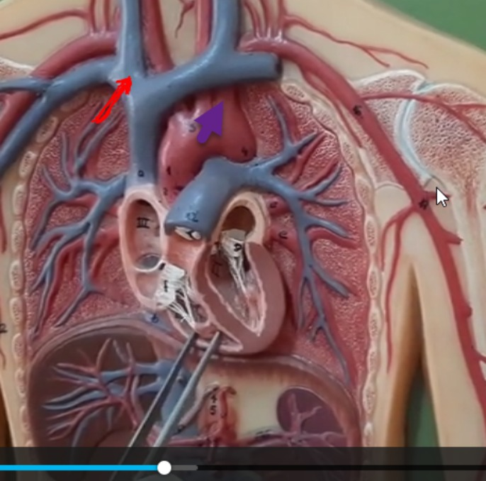
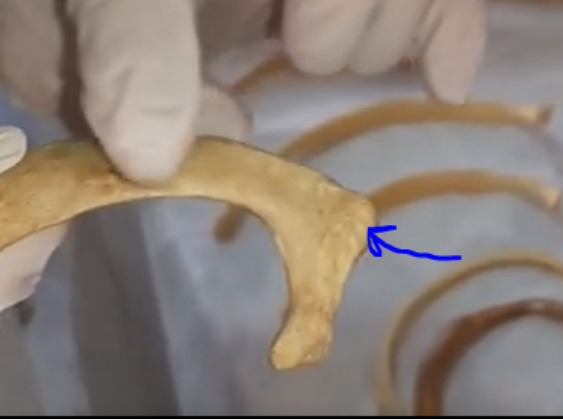
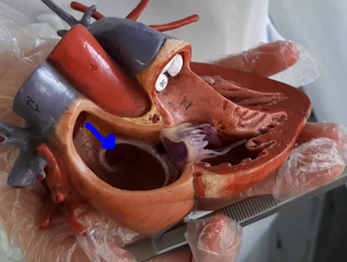
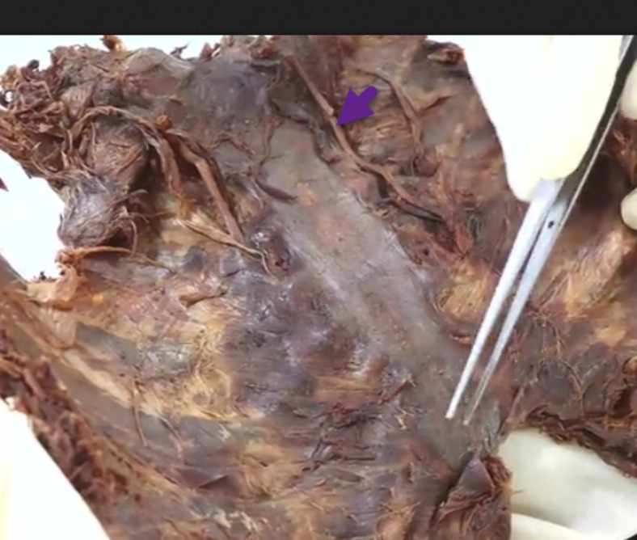
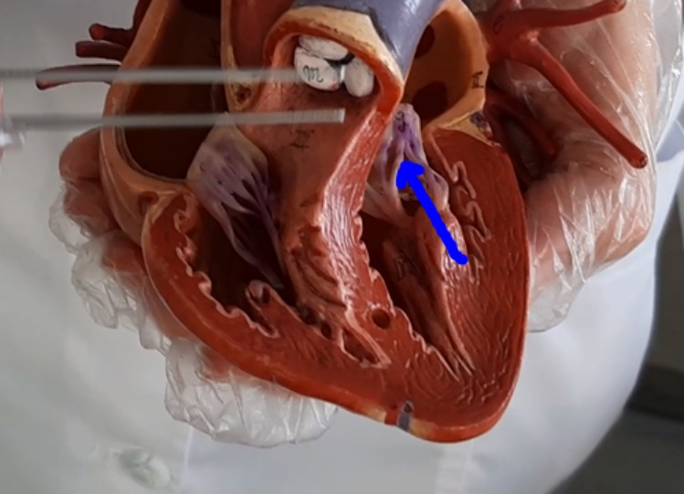
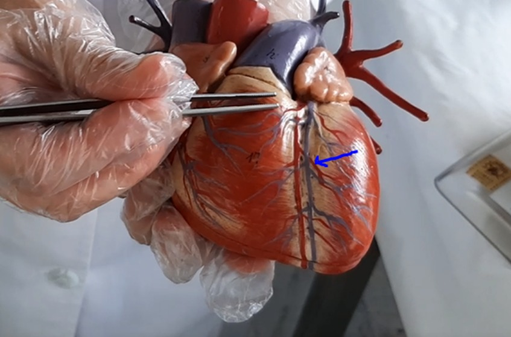
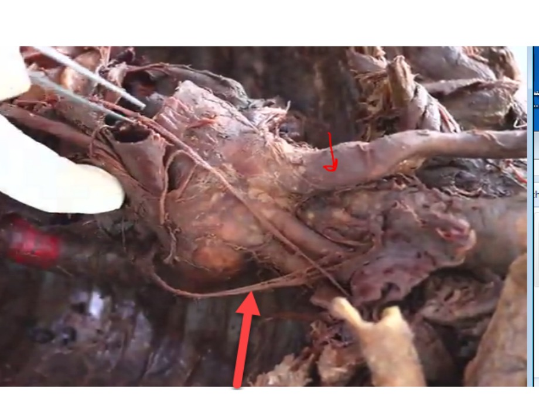
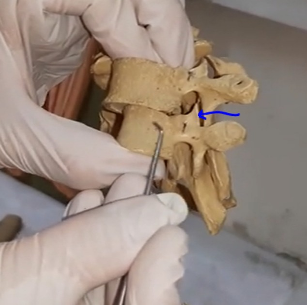
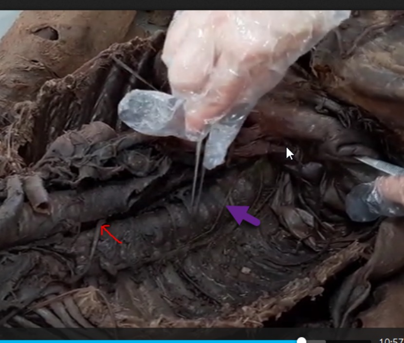
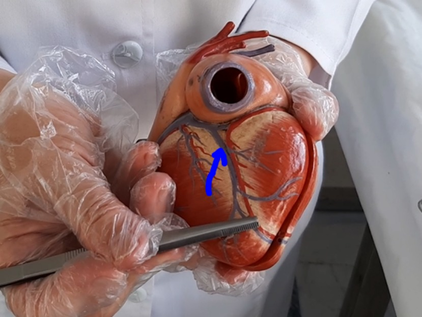

# CVS Practical · September 2021 / 19 December

14 identifiable items. The filename supplies the semester and 19 December date; the 20 on the report denotes duration, not the number of questions.

## Source and grading status

14 recovered question records / 14 expected in this fragment. 12 can be compared with a transcribed source mark. This is NOT an independently verified official medical answer key.

No new practice questions have been inserted. Original wording and choice order are retained as extracted; spelling/scan defects are not silently corrected. OCR or disputed items remain ungraded. A–D denote choice order when source labels are numeric.

## Source files

- [question-paper-with-figures-and-marks.pdf](source.pdf) — originally `CVS Practical September 2021(Exam 19 Dec).pdf`; SHA-256 `22e1004b6710b31fc16a1237d3cd886d1c755eeb9781fe927d9293de2b821242`.

## Answer key / status

| Q | Supplied answer | Marking status |
|---|---|---|
| 1 | C | Source-key comparison only |
| 2 | A | Source-key comparison only |
| 3 | C | Source-key comparison only |
| 4 | A | Source-key comparison only |
| 5 | D | Source-key comparison only |
| 6 | D | Source-key comparison only |
| 7 | C | Source-key comparison only |
| 8 | D | Source-key comparison only |
| 9 | C | Source-key comparison only |
| 10 | B | Source-key comparison only |
| 11 | B | Ungraded |
| 12 | A | Source-key comparison only |
| 13 | A | Source-key comparison only |
| 14 | C | Ungraded |

## Questions

### Q1 · source page 1

Which of the following structures does the arrow head refer to?

A. Vena cava superior and right brachiocephalic vein
B. Left brachiocephalic vein and left common carotid artery
C. Right brachiocephalic vein and left subclavian artery
D. Right brachiocephalic vein and right common carotid artery

**Answer:** C. Provided source mark only; not independently verified as the medically correct answer or as an official university key.



### Q2 · source page 2

Which of the following structures does the arrow head refer to?

A. Tubercle of rib
B. Body of rib
C. Head of rib
D. Neck of rib

**Answer:** A. Provided source mark only; not independently verified as the medically correct answer or as an official university key.



### Q3 · source page 3

Which of the following structures does the arrow head refer to?

A. Infundibulum
B. Moderator band
C. Limbus fossa ovalis
D. Valve of coronary sinus

**Answer:** C. Provided source mark only; not independently verified as the medically correct answer or as an official university key.



### Q4 · source page 4

Which of the following structures does the arrow head refer to?

A. Internal thoracic artery
B. Internal thoracic vein
C. Sternum
D. Subclavian vein

**Answer:** A. Provided source mark only; not independently verified as the medically correct answer or as an official university key.



### Q5 · source page 5

Which of the following structures does the arrow head refer to?

A. Tricuspid valve
B. Left auricle
C. Pulmonary valve
D. Chordae tendineae

**Answer:** D. Provided source mark only; not independently verified as the medically correct answer or as an official university key.



### Q6 · source page 6

Which of the following structures does the arrow head refer to?

A. Lesser cardiac vein
B. Circumflex artery
C. Right coronary artery
D. Diagonal artery

**Answer:** D. Provided source mark only; not independently verified as the medically correct answer or as an official university key.



### Q7 · source page 7

Which of the following structures does the arrow head refer to? Pay attention in this picture you can find arch of Aorta and its branches

A. Left subclavian artery and left subclavian artery
B. Right vagus nerve and right phrenic nerve
C. Left vagus nerve and brachiocephalic trunk
D. Right and left phrenic nerve

**Answer:** C. Provided source mark only; not independently verified as the medically correct answer or as an official university key.



### Q8 · source page 8

Which of the following structures does the arrow head refer to?

A. Pedicle
B. Lamina
C. Vertebral foramen
D. Superior articular process

**Answer:** D. Provided source mark only; not independently verified as the medically correct answer or as an official university key.



### Q9 · source page 9

Which of the following structures does the arrow head refer to?

A. Right and left vagus nerve
B. Trachea and phrenic nerve
C. Right vagus nerve and greater splanchnic nerve
D. Phrenic nerve and vagus nerve

**Answer:** C. Provided source mark only; not independently verified as the medically correct answer or as an official university key.



### Q10 · source page 10

Which of the following structures does the arrow head refer to?

A. Lesser cardiac vein
B. Middle cardiac vein
C. Greater cardiac vein
D. Sinus coronary

**Answer:** B. Provided source mark only; not independently verified as the medically correct answer or as an official university key.



### Q11 · source page 11

Which structure is shown in the picture marked with?

A. Pseudostratified epithelium in palatine tonsil
B. Stratified squamous epithelium in palatine tonsil
C. Stratified squamous epithelium in pharyngeal tonsil
D. Pseudostatified epithelium in pharyngeal tonsil

**Answer:** B. Provided source mark only; not independently verified as the medically correct answer or as an official university key.

**Review flags:** Required figure needs original source page

### Q12 · source page 11

Which type of vessel do you observe in this picture?

A. Muscular artery
B. Elastic artery
C. Medium vein
D. Large vein

**Answer:** A. Provided source mark only; not independently verified as the medically correct answer or as an official university key.

### Q13 · source page 12

Which organ do you observe in this picture?

A. lymphnode
B. Thymus
C. spleen
D. Palatine tonsil

**Answer:** A. Provided source mark only; not independently verified as the medically correct answer or as an official university key.

### Q14 · source page 12

Which type of vessel is shown in the picture marked with?

A. Medium artery
B. Large vein
C. Medium vein
D. venule

**Answer:** C. Provided source mark only; not independently verified as the medically correct answer or as an official university key.

**Review flags:** Required figure needs original source page

## Complete source transcription appendix

Every page is retained below, including covers, continued stems, omitted/unrecovered items and source-key annotations. The source files remain the authority if OCR is unclear. These transcriptions are not proof that a handwritten mark is correct.

### question-paper-with-figures-and-marks.pdf

#### Original page 1

```text
آزمون: Cardiovascular system practical  بر اساس دفترچه کاربر20:مدت آزمون
Anatomy of cardiovascular block
1-
Which of the following structures does the arrow head refer to?
Vena cava superior and right brachiocephalic vein
Left brachiocephalic vein and left common carotid artery
Right brachiocephalic vein and left subclavian artery

Right brachiocephalic vein and right common carotid artery
```

#### Original page 2

```text
آزمون: Cardiovascular system practical  بر اساس دفترچه کاربر20:مدت آزمون
2-
Which of the following structures does the arrow head refer to?
Tubercle of rib

Body of rib
Head of rib
Neck of rib
```

#### Original page 3

```text
آزمون: Cardiovascular system practical  بر اساس دفترچه کاربر20:مدت آزمون
3-
Which of the following structures does the arrow head refer to?
Infundibulum
Moderator band
Limbus fossa ovalis

Valve of coronary sinus
```

#### Original page 4

```text
آزمون: Cardiovascular system practical  بر اساس دفترچه کاربر20:مدت آزمون
4-
Which of the following structures does the arrow head refer to?
Internal thoracic artery

Internal thoracic vein
Sternum
Subclavian vein
```

#### Original page 5

```text
آزمون: Cardiovascular system practical  بر اساس دفترچه کاربر20:مدت آزمون
5-
Which of the following structures does the arrow head refer to?
Tricuspid valve
Left auricle
Pulmonary valve
Chordae tendineae

```

#### Original page 6

```text
آزمون: Cardiovascular system practical  بر اساس دفترچه کاربر20:مدت آزمون
6-
Which of the following structures does the arrow head refer to?
Lesser cardiac vein
Circumflex artery
Right coronary artery
Diagonal artery

```

#### Original page 7

```text
آزمون: Cardiovascular system practical  بر اساس دفترچه کاربر20:مدت آزمون
7-
Which of the following structures does the arrow head refer to?
Pay attention in this picture you can find arch of Aorta and its branches
Left subclavian artery and left subclavian artery
Right vagus nerve and right phrenic nerve
Left vagus nerve and brachiocephalic trunk

Right and left phrenic nerve
```

#### Original page 8

```text
آزمون: Cardiovascular system practical  بر اساس دفترچه کاربر20:مدت آزمون
8-
Which of the following structures does the arrow head refer to?
Pedicle
Lamina
Vertebral foramen
Superior articular process

```

#### Original page 9

```text
آزمون: Cardiovascular system practical  بر اساس دفترچه کاربر20:مدت آزمون
9-
Which of the following structures does the arrow head refer to?
Right and left vagus nerve
Trachea and phrenic nerve
Right vagus nerve and greater splanchnic nerve

Phrenic nerve and vagus nerve
```

#### Original page 10

```text
آزمون: Cardiovascular system practical  بر اساس دفترچه کاربر20:مدت آزمون
10-
Which of the following structures does the arrow head refer to?
Lesser cardiac vein
Middle cardiac vein

Greater cardiac vein
Sinus coronary
Histology of cardiovascular block
```

#### Original page 11

```text
آزمون: Cardiovascular system practical  بر اساس دفترچه کاربر20:مدت آزمون
11- Which structure is shown in the picture marked with?
Pseudostratified epithelium in palatine tonsil
Stratified squamous epithelium in palatine tonsil

Stratified squamous epithelium in pharyngeal tonsil
Pseudostatified epithelium in pharyngeal tonsil
12- Which type of vessel do you observe in this picture?
Muscular artery

Elastic artery
Medium vein
Large vein
```

#### Original page 12

```text
آزمون: Cardiovascular system practical  بر اساس دفترچه کاربر20:مدت آزمون
13- Which organ do you observe in this picture?
lymphnode

Thymus
spleen
Palatine tonsil
14- Which type of vessel is shown in the picture marked with?
Medium artery
Large vein
Medium vein

venule
```

#### Original page 13

```text

```

