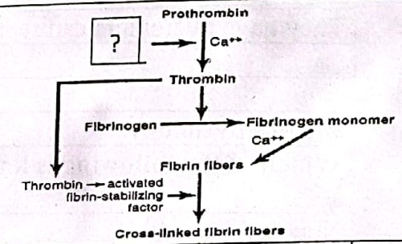
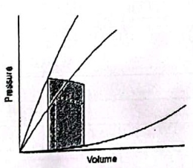

# CVS Final · 4 January 2023

Cover: September 2022 semester, 4 January 2023. PDF page 9 repeats Q24–27 and is not counted twice. Handwritten marks are student work, not an official key.

## Source and grading status

100 recovered question records / 100 expected in this fragment. 0 can be compared with a transcribed source mark. This is NOT an independently verified official medical answer key.

No new practice questions have been inserted. Original wording and choice order are retained as extracted; spelling/scan defects are not silently corrected. OCR or disputed items remain ungraded. A–D denote choice order when source labels are numeric.

## Source files

- [question-paper-student-copy.pdf](source.pdf) — originally `CVS_2023_TUMS.pdf`; SHA-256 `5540cd48e0bc970862fa797f5c5d2f8cc05b76f0837d5ff2292386d55882e605`.

## Answer key / status

| Q | Supplied answer | Marking status |
|---|---|---|
| 1 | Not supplied / unverified | Ungraded |
| 2 | Not supplied / unverified | Ungraded |
| 3 | Not supplied / unverified | Ungraded |
| 4 | Not supplied / unverified | Ungraded |
| 5 | Not supplied / unverified | Ungraded |
| 6 | Not supplied / unverified | Ungraded |
| 7 | Not supplied / unverified | Ungraded |
| 8 | Not supplied / unverified | Ungraded |
| 9 | Not supplied / unverified | Ungraded |
| 10 | Not supplied / unverified | Ungraded |
| 11 | Not supplied / unverified | Ungraded |
| 12 | Not supplied / unverified | Ungraded |
| 13 | Not supplied / unverified | Ungraded |
| 14 | Not supplied / unverified | Ungraded |
| 15 | Not supplied / unverified | Ungraded |
| 16 | Not supplied / unverified | Ungraded |
| 17 | Not supplied / unverified | Ungraded |
| 18 | Not supplied / unverified | Ungraded |
| 19 | Not supplied / unverified | Ungraded |
| 20 | Not supplied / unverified | Ungraded |
| 21 | Not supplied / unverified | Ungraded |
| 22 | Not supplied / unverified | Ungraded |
| 23 | Not supplied / unverified | Ungraded |
| 24 | Not supplied / unverified | Ungraded |
| 25 | Not supplied / unverified | Ungraded |
| 26 | Not supplied / unverified | Ungraded |
| 27 | Not supplied / unverified | Ungraded |
| 28 | Not supplied / unverified | Ungraded |
| 29 | Not supplied / unverified | Ungraded |
| 30 | Not supplied / unverified | Ungraded |
| 31 | Not supplied / unverified | Ungraded |
| 32 | Not supplied / unverified | Ungraded |
| 33 | Not supplied / unverified | Ungraded |
| 34 | Not supplied / unverified | Ungraded |
| 35 | Not supplied / unverified | Ungraded |
| 36 | Not supplied / unverified | Ungraded |
| 37 | Not supplied / unverified | Ungraded |
| 38 | Not supplied / unverified | Ungraded |
| 39 | Not supplied / unverified | Ungraded |
| 40 | Not supplied / unverified | Ungraded |
| 41 | Not supplied / unverified | Ungraded |
| 42 | Not supplied / unverified | Ungraded |
| 43 | Not supplied / unverified | Ungraded |
| 44 | Not supplied / unverified | Ungraded |
| 45 | Not supplied / unverified | Ungraded |
| 46 | Not supplied / unverified | Ungraded |
| 47 | Not supplied / unverified | Ungraded |
| 48 | Not supplied / unverified | Ungraded |
| 49 | Not supplied / unverified | Ungraded |
| 50 | Not supplied / unverified | Ungraded |
| 51 | Not supplied / unverified | Ungraded |
| 52 | Not supplied / unverified | Ungraded |
| 53 | Not supplied / unverified | Ungraded |
| 54 | Not supplied / unverified | Ungraded |
| 55 | Not supplied / unverified | Ungraded |
| 56 | Not supplied / unverified | Ungraded |
| 57 | Not supplied / unverified | Ungraded |
| 58 | Not supplied / unverified | Ungraded |
| 59 | Not supplied / unverified | Ungraded |
| 60 | Not supplied / unverified | Ungraded |
| 61 | Not supplied / unverified | Ungraded |
| 62 | Not supplied / unverified | Ungraded |
| 63 | Not supplied / unverified | Ungraded |
| 64 | Not supplied / unverified | Ungraded |
| 65 | Not supplied / unverified | Ungraded |
| 66 | Not supplied / unverified | Ungraded |
| 67 | Not supplied / unverified | Ungraded |
| 68 | Not supplied / unverified | Ungraded |
| 69 | Not supplied / unverified | Ungraded |
| 70 | Not supplied / unverified | Ungraded |
| 71 | Not supplied / unverified | Ungraded |
| 72 | Not supplied / unverified | Ungraded |
| 73 | Not supplied / unverified | Ungraded |
| 74 | Not supplied / unverified | Ungraded |
| 75 | Not supplied / unverified | Ungraded |
| 76 | Not supplied / unverified | Ungraded |
| 77 | Not supplied / unverified | Ungraded |
| 78 | Not supplied / unverified | Ungraded |
| 79 | Not supplied / unverified | Ungraded |
| 80 | Not supplied / unverified | Ungraded |
| 81 | Not supplied / unverified | Ungraded |
| 82 | Not supplied / unverified | Ungraded |
| 83 | Not supplied / unverified | Ungraded |
| 84 | Not supplied / unverified | Ungraded |
| 85 | Not supplied / unverified | Ungraded |
| 86 | Not supplied / unverified | Ungraded |
| 87 | Not supplied / unverified | Ungraded |
| 88 | Not supplied / unverified | Ungraded |
| 89 | Not supplied / unverified | Ungraded |
| 90 | Not supplied / unverified | Ungraded |
| 91 | Not supplied / unverified | Ungraded |
| 92 | Not supplied / unverified | Ungraded |
| 93 | Not supplied / unverified | Ungraded |
| 94 | Not supplied / unverified | Ungraded |
| 95 | Not supplied / unverified | Ungraded |
| 96 | Not supplied / unverified | Ungraded |
| 97 | Not supplied / unverified | Ungraded |
| 98 | Not supplied / unverified | Ungraded |
| 99 | Not supplied / unverified | Ungraded |
| 100 | Not supplied / unverified | Ungraded |

## Questions

### Q1 · source page 2

..in A person who is suffering from chronic kidney disease may need to receive .... order to produce RBCs.

A. erythropoietin
B. whole blood
C. bone marrow transplantation
D. fresh frozen plasma

**Answer:** Not reliably supplied. No reliable answer key matched to this question. Kept ungraded; use the supplied source and course references to self-mark.

**Review flags:** OCR table segmentation is provisional; compare with original; OCR transcription — source-page review required

### Q2 · source page 2

Which of the following is considered to be the main cause of "Aplastic Anemia"?

A. Lack of functioning bone marrow
B. Lack of RBC function E
C. Lack of carbonic anhydrase enzyme
D. Iron deficiency

**Answer:** Not reliably supplied. No reliable answer key matched to this question. Kept ungraded; use the supplied source and course references to self-mark.

**Review flags:** OCR table segmentation is provisional; compare with original; OCR transcription — source-page review required

### Q3 · source page 2

Which of the following is not considered to be one of the characteristics of platelets? They are minute discs 1 to 4 micrometers in diameter.

A. They are formed in the bone marrow from megakaryocytes.
B. The normal concentration of platelets in the blood is between 150,000 and 300,000 per
C. microliter.
D. They have nuclei and can reproduce.

**Answer:** Not reliably supplied. No reliable answer key matched to this question. Kept ungraded; use the supplied source and course references to self-mark.

**Review flags:** OCR table segmentation is provisional; compare with original; OCR transcription — source-page review required

### Q4 · source page 2

Which of the following is known as a white blood cell with the stronger chemotaxis? Neutrophils

A. Basophils
B. Eosinophils J
C. Lymphocytes
D. 2|Page

**Answer:** Not reliably supplied. No reliable answer key matched to this question. Kept ungraded; use the supplied source and course references to self-mark.

**Review flags:** OCR table segmentation is provisional; compare with original; OCR transcription — source-page review required

### Q5 · source page 3

Which of the following refers to the main importance of "Walling off" effect?

A. To accelerate chemicals release Lill
B. To decrease cytokines secretion
C. To accelerate inflammatory responses
D. To delay the spread of bacteria

**Answer:** Not reliably supplied. No reliable answer key matched to this question. Kept ungraded; use the supplied source and course references to self-mark.

**Review flags:** OCR table segmentation is provisional; compare with original; OCR transcription — source-page review required

### Q6 · source page 3

Which mediators are involved in the second líne of defense against infection?

A. Selectin and ICAM-1
B. GM -CSF and G-CSF
C. Living bacteria and cellular exudate J
D. Histamin and bradikinine

**Answer:** Not reliably supplied. No reliable answer key matched to this question. Kept ungraded; use the supplied source and course references to self-mark.

**Review flags:** OCR table segmentation is provisional; compare with original; OCR transcription — source-page review required

### Q7 · source page 3

Immediately after a blood vessel is ruptured, trauma to the vessel wall causes ......... .

A. vascular constriction
B. platelet plug formation
C. intrinsic pathway of blood coagulation activation
D. extrinsic pathway of blood coagulation activation

**Answer:** Not reliably supplied. No reliable answer key matched to this question. Kept ungraded; use the supplied source and course references to self-mark.

### Q8 · source page 3

In the opposite figure, what should be written instead of question mark?

A. Factor X
B. Vascular trauma
C. Prothrombin activator
D. Factor XII

**Answer:** Not reliably supplied. No reliable answer key matched to this question. Kept ungraded; use the supplied source and course references to self-mark.



### Q9 · source page 4

Which of the following is not included in the fibrinolytic system?

A. Plasminogen
B. Tissue plasminogen activator
C. plasminogen activator inhibitor
D. Protein C

**Answer:** Not reliably supplied. No reliable answer key matched to this question. Kept ungraded; use the supplied source and course references to self-mark.

**Review flags:** OCR table segmentation is provisional; compare with original; OCR transcription — source-page review required

### Q10 · source page 4

Which organ produces the largest number of red blood cells in the middle trimester of pregnancy?

A. Liver
B. Spleen
C. Bone marrow
D. Lymph node

**Answer:** Not reliably supplied. No reliable answer key matched to this question. Kept ungraded; use the supplied source and course references to self-mark.

**Review flags:** OCR table segmentation is provisional; compare with original; OCR transcription — source-page review required

### Q11 · source page 4

In control of bone marrow production of granulocytes and monocyte-macrophages, what should be written instead of question mark? INFLAMMATION sndothoilnl colls 1o00l85 aranulocytes Vonocytes/macrophages TNF

A. IL-6
B. Selectin
C. ICAM-1
D. 4| Page

**Answer:** Not reliably supplied. No reliable answer key matched to this question. Kept ungraded; use the supplied source and course references to self-mark.

**Review flags:** OCR table segmentation is provisional; compare with original; OCR transcription — source-page review required

### Q12 · source page 5

The least amount of iron in the body is found in the form of ......... 12

A. Transferrin Lill
B. Ferritin
C. Myoglobin
D. Hemoglobin

**Answer:** Not reliably supplied. No reliable answer key matched to this question. Kept ungraded; use the supplied source and course references to self-mark.

**Review flags:** OCR table segmentation is provisional; compare with original; OCR transcription — source-page review required

### Q13 · source page 5

Atrial systole

A. Causes a decrease in atrial pressure Lill /
B. Causes the 'a' wave of the jugular pulse
C. Causes the 'c' wave of the jugular pulse
D. Causes the 'v' wave of the jugular pulse.

**Answer:** Not reliably supplied. No reliable answer key matched to this question. Kept ungraded; use the supplied source and course references to self-mark.

**Review flags:** OCR transcription — source-page review required

### Q14 · source page 5

During cardiac cycle the atrial pressure: Lil

A. Rises during atrial systole and drops during isovolumetric contraction.
B. Falls rapidly during ventricular ejection.
C. Rises as blood flows passively into the ventricles.
D. Decreased markedly in tricuspid regurgitation.

**Answer:** Not reliably supplied. No reliable answer key matched to this question. Kept ungraded; use the supplied source and course references to self-mark.

**Review flags:** OCR transcription — source-page review required

### Q15 · source page 5

During isovolumetric ventricular contraction phase

A. Mitral and tricuspid valves closure causing second heart sound Lill
B. Intraventricular pressure is increased without change in ventricular volume.
C. Atrioventricular valves bulge into the atria causing a drop in atrial pressure
D. QRS complex coincides with ventricular contraction 5 | P age

**Answer:** Not reliably supplied. No reliable answer key matched to this question. Kept ungraded; use the supplied source and course references to self-mark.

**Review flags:** OCR transcription — source-page review required

### Q16 · source page 6

Regarding atrial systole all the followings occurs EXCEPT: Lill

A. The mitral and tricuspid valves are open and the aortic and pulmonary valves are closed
B. Contraction of the atria pushes 30% of blood into the ventricles.
C. Contraction of the atrial muscle prevents regurgitation of blood into the veins.
D. P wave precedes atrial systole.

**Answer:** Not reliably supplied. No reliable answer key matched to this question. Kept ungraded; use the supplied source and course references to self-mark.

**Review flags:** OCR transcription — source-page review required

### Q17 · source page 6

Starling's law of the heart 7

A. concerns the relationship between the degree of stretch of cardiac muscle and ill the force of contraction
B. states that'the stroke volumes of the left and right ventricles are matched
C. causes an increase of contractility of cardiac muscle
D. can equally be applied to skeletal as well as cardiac muscle

**Answer:** Not reliably supplied. No reliable answer key matched to this question. Kept ungraded; use the supplied source and course references to self-mark.

**Review flags:** OCR transcription — source-page review required

### Q18 · source page 6

During ventricular ejection: 8

A. The left ventricular pressure is increased to 120 mmHg and that of the right ventricle Lill to 80'mmHg.
B. Late in systole the momentum keeps the blood moving forward because the aortic pressure drops suddenly.
C. The amount of the blood ejected by each ventricle per cycle at rest is 130 mL.
D. The atrioventricular valves are pulled down and atrial pressure drops. uio

**Answer:** Not reliably supplied. No reliable answer key matched to this question. Kept ungraded; use the supplied source and course references to self-mark.

**Review flags:** OCR transcription — source-page review required

### Q19 · source page 6

Funny currents persist... Lill

A. at all times throughout SA Nodal cell AP propagation
B. only when an SA nodal cell is hyperpolarized
C. only during the repolarization of an SA nodal cell
D. none of the above. 6| Page

**Answer:** Not reliably supplied. No reliable answer key matched to this question. Kept ungraded; use the supplied source and course references to self-mark.

**Review flags:** OCR transcription — source-page review required

### Q20 · source page 7

The ionic basis of the automaticity in the nodal cells that mediates the slow diastolic depolarization is all but Lill

A. hyperpolarization-induced Nat inward current (ir)
B. an outward ik* current (iк)
C. an inward rectifying Kt current (Kı)
D. an inward Cat2 current through L-type Cat channels (Ica)

**Answer:** Not reliably supplied. No reliable answer key matched to this question. Kept ungraded; use the supplied source and course references to self-mark.

**Review flags:** OCR transcription — source-page review required

### Q21 · source page 7

In aortic pressure curve:

A. Ventricular systole stretches aortic and arterial walls and causes systolic pressure of 120 mm Hg.
B. Dicrotic notch occurs when the aortic valve opens.
C. Incisura is caused by forward flow of blood before closure of the valve.
D. Elastic recoil of the aorta and arterial walls maintain diastolic pressure of 80 mm Hg.

**Answer:** Not reliably supplied. No reliable answer key matched to this question. Kept ungraded; use the supplied source and course references to self-mark.

### Q22 · source page 7

Cardiac sympathetic nerve activation:

A. Shifts the cardiac output curve downwards and to the right.
B. Increases the formation of cAMP via β1 receptors.
C. Deactivates the ligand-gated Ca2+ channels of the ryanodine receptor.
D. Decreases active reuptake of Ca2+

**Answer:** Not reliably supplied. No reliable answer key matched to this question. Kept ungraded; use the supplied source and course references to self-mark.

### Q23 · source page 7

Below graph shows the pressure-volume curve of the left ventricle of a normal subject (broken lines) and a patient. Compared to normal, which term best describes this patient

A. Decreased afterload
B. Decreased preload
C. Decreased stroke volume
D. Increased force of contraction

**Answer:** Not reliably supplied. No reliable answer key matched to this question. Kept ungraded; use the supplied source and course references to self-mark.



### Q24 · source page 8

Left axis deviation of the ECG is described when:

A. the axis of the heart is from -30° to +90 ° will
B. the QRS complex is prominent positive in lead aVF
C. the QRS is prominent positive in lead I and prominent negative in lead III.
D. right ventricle is enlarged

**Answer:** Not reliably supplied. No reliable answer key matched to this question. Kept ungraded; use the supplied source and course references to self-mark.

**Review flags:** OCR transcription — source-page review required

### Q25 · source page 8

Regarding the conduction system of the heart 25

A. the right bundle branch divides into anterior and posterior fascicles Lill
B. the AV node contains P and T cells
C. myocardial fibers have a resting membrane potential of -60 mV
D. action potential in the SA and AV nodes are largely due to Nat influx

**Answer:** Not reliably supplied. No reliable answer key matched to this question. Kept ungraded; use the supplied source and course references to self-mark.

**Review flags:** OCR transcription — source-page review required

### Q26 · source page 8

Which of the following changes will cause an increase in myocardial Oz consumption? 26

A. Decreased aortic pressure цill
B. Decreased heart rate
C. Increased size of the heart
D. Increased influx of Na during the upstroke of the action potential

**Answer:** Not reliably supplied. No reliable answer key matched to this question. Kept ungraded; use the supplied source and course references to self-mark.

**Review flags:** OCR transcription — source-page review required

### Q27 · source page 8

Considering conduction rates in myocardial cells, which statement is TRUE 27

A. Purkinje fibers are subepicardial and the largest fibers, 4-7 times the width of other Lill fibers
B. Purkinje fibers are 'fast fibers', and can conduct a wave of depolarization at a speed of 4m/sec
C. Duration of the action potential and refractory period in fast fibers is shorter than slow fibers
D. Initial depolarization occurs in fast fibers with a rapid influx of Ca2+ ions 8| Page

**Answer:** Not reliably supplied. No reliable answer key matched to this question. Kept ungraded; use the supplied source and course references to self-mark.

**Review flags:** OCR transcription — source-page review required

### Q28 · source page 10

Regarding the Cardiac sympathetic nerve stimulation all the followings are correct ЕХCЕРІ: Lill

A. Has positive inotropic effect.
B. Causes L-type Caft channel to spend more time in the open state.
C. Accelerates relaxation and shortens systole.
D. Lengthens the AV nodal delay

**Answer:** Not reliably supplied. No reliable answer key matched to this question. Kept ungraded; use the supplied source and course references to self-mark.

**Review flags:** OCR transcription — source-page review required

### Q29 · source page 10

The ventricles are completely depolarized during which portion of the electrocardiogram? Lil

A. PR interval
B. QRS complex
C. QT interval
D. ST segment • Which of the following is INCORRECT concerning diastolic depolarization at the SA

**Answer:** Not reliably supplied. No reliable answer key matched to this question. Kept ungraded; use the supplied source and course references to self-mark.

**Review flags:** OCR transcription — source-page review required

### Q30 · source page 10

Which of the following is INCORRECT concerning diastolic depolarization at the SA node?

A. It results from an outward K+ current, iK
B. It results from the activation of If carried mainly by Na funny channels.
C. Its rate is decreased by sympathetic stimulation.
D. It results from an inward Ca++ current, ICa.

**Answer:** Not reliably supplied. No reliable answer key matched to this question. Kept ungraded; use the supplied source and course references to self-mark.

### Q31 · source page 10

What is the normal QT interval:

A. 0.03 seconds
B. 0.13 seconds
C. 0.16 seconds
D. 0.35 seconds

**Answer:** Not reliably supplied. No reliable answer key matched to this question. Kept ungraded; use the supplied source and course references to self-mark.

### Q32 · source page 11

• A 66-year old male presents with angina and dyspnea on exertion. Auscultation of the chest reveals a load systolic murmur. He is diagnosed with aortic valye sclerosis. This stenosis of the aortic valve will cause a murmur that can be heard loudest at which interval shown Volume B A Pressure ill

A. between A and B
B. between B and C
C. between C and D
D. between D and A

**Answer:** Not reliably supplied. No reliable answer key matched to this question. Kept ungraded; use the supplied source and course references to self-mark.

**Review flags:** OCR transcription — source-page review required

### Q33 · source page 11

Regarding the ECG findings of myocardial infarction (MI) all the following are correct EXCEPT: Lil

A. Elevation of the ST segment in recent (acute) MI.
B. Deep and wide Qwave in old MI.
C. Low voltage in massive MI.
D. Prominent U wave. rnational campus Vice-Dean for Educational Affairs

**Answer:** Not reliably supplied. No reliable answer key matched to this question. Kept ungraded; use the supplied source and course references to self-mark.

**Review flags:** OCR transcription — source-page review required

### Q34 · source page 12

Which of the following is not the homeostatic action of blood circulation?

A. Temperature regulation
B. Blood pressure
C. Cells Immunity
D. Feeding the cells

**Answer:** Not reliably supplied. No reliable answer key matched to this question. Kept ungraded; use the supplied source and course references to self-mark.

**Review flags:** OCR table segmentation is provisional; compare with original; OCR transcription — source-page review required

### Q35 · source page 12

In blood flow issue, which sentence is not correct? Reduction in RBC No. reduces critical closure point unit. Decrease in filling pressure will happen with vasodilatation.

A. With increase in the artery diameter the pressure to the wall would
B. increase.
C. An increase in blood flow, the viscosity effect will decrease
D. Otestiom bimee

**Answer:** Not reliably supplied. No reliable answer key matched to this question. Kept ungraded; use the supplied source and course references to self-mark.

**Review flags:** OCR table segmentation is provisional; compare with original; OCR transcription — source-page review required

### Q36 · source page 12

In comparing between 2 kinds of circulation, which one is correct? The blood volume in 2 circulation are equal.

A. The blood pressure in 2 circulation are equal.
B. The ejection fraction in big circulation is higher than small circulation.
C. The stroke volume in 2 circulations are equal
D. FOttestion time

**Answer:** Not reliably supplied. No reliable answer key matched to this question. Kept ungraded; use the supplied source and course references to self-mark.

**Review flags:** OCR table segmentation is provisional; compare with original; OCR transcription — source-page review required

### Q37 · source page 12

In the blood flow issue, select correct sentence: Blood flow have direct relation with vessels length

A. Blood velocity have indirect effect with vessel length
B. Resistance have indirect relation with vessels radius
C. Blood flow have direct relation with viscosity
D. 11 | Page

**Answer:** Not reliably supplied. No reliable answer key matched to this question. Kept ungraded; use the supplied source and course references to self-mark.

**Review flags:** OCR table segmentation is provisional; compare with original; OCR transcription — source-page review required

### Q38 · source page 13

In the changing of the tendency flow from laminar to turbulent, which of the following has positive effects?

A. Increase in viscosity
B. Vessel partial occlusion
C. Increase in velocity
D. Reduction in diameter

**Answer:** Not reliably supplied. No reliable answer key matched to this question. Kept ungraded; use the supplied source and course references to self-mark.

**Review flags:** OCR table segmentation is provisional; compare with original; OCR transcription — source-page review required

### Q39 · source page 13

Mean arterial flow in a person is 70 mm/ Hg how are the baroreceptor and chemoreceptor activity?

A. They don't have any activity
B. Baroreceptors are active and chemoreceptor inactive
C. only chemoreceptors are active and baroreceptor are inactive
D. Both receptors are smoothly active

**Answer:** Not reliably supplied. No reliable answer key matched to this question. Kept ungraded; use the supplied source and course references to self-mark.

**Review flags:** OCR table segmentation is provisional; compare with original; OCR transcription — source-page review required

### Q40 · source page 13

Write the wanted amount and units of followings, respectively: Right ventricle diastolic pressure, right atrium systolic pressure, Normal capillary tension in mm/Hg and pulse pressure (from left to right)

A. 80-25-60-90
B. 8-8-17-40
C. 25-20-17-40
D. 95-80-8-15

**Answer:** Not reliably supplied. No reliable answer key matched to this question. Kept ungraded; use the supplied source and course references to self-mark.

### Q41 · source page 13

Which of the following causes tissue edema? Reduction in capillary hydrostatic pressure

A. Increase in capillary colloid osmotic pressure
B. Increase in filtration co-efficient
C. Increase in lymphatic flow
D. ormational campus Vice-Dean for Educational Affairs

**Answer:** Not reliably supplied. No reliable answer key matched to this question. Kept ungraded; use the supplied source and course references to self-mark.

**Review flags:** OCR table segmentation is provisional; compare with original; OCR transcription — source-page review required

### Q42 · source page 14

select correct sentence.

A. Increase in compliance Cause an increase in systolic blood pressure.
B. Decrease in compliance Cause reduction in pulse pressure
C. Increase in blood volume increases pulse pressure
D. Increase in stroke volume decreases systolic pressure.

**Answer:** Not reliably supplied. No reliable answer key matched to this question. Kept ungraded; use the supplied source and course references to self-mark.

### Q43 · source page 14

Which of the following organs have highest and lowest blood volume in the moment respectively? Heart- pulmonary organ Muscle- CNS GI- thyroid

A. Liver- skin
B. Source
C. Description.
D. Ouestion tme

**Answer:** Not reliably supplied. No reliable answer key matched to this question. Kept ungraded; use the supplied source and course references to self-mark.

**Review flags:** OCR table segmentation is provisional; compare with original; OCR transcription — source-page review required

### Q44 · source page 14

Which of the following causes an increase in the PRU? Anemia

A. Heavy pain
B. Organ amputation
C. Shock
D. Ouestion time

**Answer:** Not reliably supplied. No reliable answer key matched to this question. Kept ungraded; use the supplied source and course references to self-mark.

**Review flags:** OCR table segmentation is provisional; compare with original; OCR transcription — source-page review required

### Q45 · source page 14

Which of the following does not happen with histamine release?

A. Edema
B. Allergic signs
C. Arteries contraction
D. Local vaso dilatation

**Answer:** Not reliably supplied. No reliable answer key matched to this question. Kept ungraded; use the supplied source and course references to self-mark.

**Review flags:** OCR table segmentation is provisional; compare with original; OCR transcription — source-page review required

### Q46 · source page 15

Which of the following tissue has the least sympathetic innervation?

A. Brain
B. Kidney
C. Intestine
D. Skin

**Answer:** Not reliably supplied. No reliable answer key matched to this question. Kept ungraded; use the supplied source and course references to self-mark.

**Review flags:** OCR table segmentation is provisional; compare with original; OCR transcription — source-page review required

### Q47 · source page 15

In the normal heart working, which of the following is mostly used to produce energy!

A. Adenosine
B. Glucose
C. Galactose
D. Fatty acids

**Answer:** Not reliably supplied. No reliable answer key matched to this question. Kept ungraded; use the supplied source and course references to self-mark.

**Review flags:** OCR table segmentation is provisional; compare with original; OCR transcription — source-page review required

### Q48 · source page 15

Active hyperemia happens in:

A. short term occlusion of artery
B. increase in tissue metabolism
C. injury of tissue
D. F4. increase in blood pressure

**Answer:** Not reliably supplied. No reliable answer key matched to this question. Kept ungraded; use the supplied source and course references to self-mark.

**Review flags:** OCR table segmentation is provisional; compare with original; OCR transcription — source-page review required

### Q49 · source page 15

In a constant resistant blood vessel, which of the following has higher blood flow? Pressure in the beginning 100 and in the end of vessel is 40 (mm/Hg)

A. Pressure in the beginning250 and in the end of vessel is 200 (mm/Hg)
B. Pressure in the beginning 80 and in the end of vessel is 10 (mm/Hg)
C. Pressure in the beginning 300 and in the end of vessel is 260 (mm/Hg)
D. national campus Vice-Dean for Educational Affairs

**Answer:** Not reliably supplied. No reliable answer key matched to this question. Kept ungraded; use the supplied source and course references to self-mark.

**Review flags:** OCR table segmentation is provisional; compare with original; OCR transcription — source-page review required

### Q50 · source page 16

Even with high changes in blood pressure, the tissue blood flow and supply do not change significantly. Why? Because of :1 sympathetic activity

A. para sympathetic activity
B. hormonal activity
C. auto regulation.
D. *Ouestion time

**Answer:** Not reliably supplied. No reliable answer key matched to this question. Kept ungraded; use the supplied source and course references to self-mark.

**Review flags:** OCR table segmentation is provisional; compare with original; OCR transcription — source-page review required

### Q51 · source page 16

In a blood vessel, flow is 80 ml/sec and pressure in main and pulmonary circulations are 120 and 20 respectively. What is the PRU in these two circulations?

A. 1.5-0.25
B. 16-25
C. 4-0.8
D. 8-12

**Answer:** Not reliably supplied. No reliable answer key matched to this question. Kept ungraded; use the supplied source and course references to self-mark.

### Q52 · source page 16

Which of the following sentence is not correct? Amputation causes increase in PRU

A. In a parallel system increase in vesseles decreases resistance
B. By developing the new vessels blood flow will increase.
C. Inhibition of sympathetic system increases critical closure point.
D. Questionitime.

**Answer:** Not reliably supplied. No reliable answer key matched to this question. Kept ungraded; use the supplied source and course references to self-mark.

**Review flags:** OCR table segmentation is provisional; compare with original; OCR transcription — source-page review required

### Q53 · source page 16

In the veins pressure which sentence is correct? Pressure of the left atrium is the same of the central vein pressure. By increasing of pumping of right heart pressure of right atrium will

A. increases.
B. Arteriole relaxation cause blood flow from arterioles to veins.
C. In the upright position the neck veins pressure is normally 4-6 mm/hg
D. International campus Vice-Dean for Educational Affairs

**Answer:** Not reliably supplied. No reliable answer key matched to this question. Kept ungraded; use the supplied source and course references to self-mark.

**Review flags:** OCR table segmentation is provisional; compare with original; OCR transcription — source-page review required

### Q54 · source page 17

In the capillary filtration issue, which sentence is correct? Activation of pre- capillary sphincter is responsible for capillary

A. vasomotion
B. Proteins easily pass through to inter cellular space via capillary fenestra
C. Activation of lymphatic pump increases local edema.
D. Protein content of lymph is equal with the plasma level of protein

**Answer:** Not reliably supplied. No reliable answer key matched to this question. Kept ungraded; use the supplied source and course references to self-mark.

**Review flags:** OCR table segmentation is provisional; compare with original; OCR transcription — source-page review required

### Q55 · source page 17

Which of the followingis not correct. Atrial and pulmonary reflexes are sensitive to blood volume and regulates arterial pressure

A. In the bodies different positions, baroreceptors regulate blood pressure
B. 3: Baroreceptors have an important role in long term regulation of blood
C. pressure
D. -4 Activation of chemo receptors Couse reduction in blood pressure.

**Answer:** Not reliably supplied. No reliable answer key matched to this question. Kept ungraded; use the supplied source and course references to self-mark.

**Review flags:** OCR table segmentation is provisional; compare with original; OCR transcription — source-page review required

### Q56 · source page 17

In which of the following vessels, turbulent flow never does not appear?

A. .1- Aorta artery
B. Pulmonary artery
C. Brachial artery
D. Arterioles

**Answer:** Not reliably supplied. No reliable answer key matched to this question. Kept ungraded; use the supplied source and course references to self-mark.

**Review flags:** OCR table segmentation is provisional; compare with original; OCR transcription — source-page review required

### Q57 · source page 17

Which of the following causes myogenic phenomena?

A. Local regulation of tissue blood pressure.
B. Local regulation of tissue blood flow
C. Reactive hyperemia
D. Active hyperemıa

**Answer:** Not reliably supplied. No reliable answer key matched to this question. Kept ungraded; use the supplied source and course references to self-mark.

**Review flags:** OCR table segmentation is provisional; compare with original; OCR transcription — source-page review required

### Q58 · source page 18

Regarding the central regulatory system (vasomotor), which sentence is not correct? C1 has direct vasoconstrictor effect on blood flow.

A. A1 has direct vasodilator effect on blood flow.
B. A2 receives informative neurons from peripheral.
C. Chemoreceptors have stimulatory effect on vasomotor and increase the
D. blood pressure

**Answer:** Not reliably supplied. No reliable answer key matched to this question. Kept ungraded; use the supplied source and course references to self-mark.

**Review flags:** OCR table segmentation is provisional; compare with original; OCR transcription — source-page review required

### Q59 · source page 18

Which of the following muscles is in the superficial layer of the erector spin muscle! Longissimus thoracis

A. Multifidus
B. Rotatores
C. Levator costarom
D. Question tim

**Answer:** Not reliably supplied. No reliable answer key matched to this question. Kept ungraded; use the supplied source and course references to self-mark.

**Review flags:** OCR table segmentation is provisional; compare with original; OCR transcription — source-page review required

### Q60 · source page 18

Which of the following structures is more anterior than the rest?

A. Right ventericle
B. Right Vagus nerve
C. Left atrium
D. Right atrium

**Answer:** Not reliably supplied. No reliable answer key matched to this question. Kept ungraded; use the supplied source and course references to self-mark.

**Review flags:** OCR table segmentation is provisional; compare with original; OCR transcription — source-page review required

### Q61 · source page 18

Ouestion tim The right margin of heart is formed mostly by which champer of the heart?

A. Left atrium
B. Right atrium
C. Left ventricle
D. Right ventricle

**Answer:** Not reliably supplied. No reliable answer key matched to this question. Kept ungraded; use the supplied source and course references to self-mark.

**Review flags:** OCR table segmentation is provisional; compare with original; OCR transcription — source-page review required

### Q62 · source page 19

Which of the following statement is correct?

A. 1 4*h Anterior intercostal artery aries from Musclophrenic artery
B. Thoracic aorta pass posterior to left atrium
C. Subcostal artery aries from internal thoracic artery
D. Left and right internal thoracic veins drains to hemi Azygous vein

**Answer:** Not reliably supplied. No reliable answer key matched to this question. Kept ungraded; use the supplied source and course references to self-mark.

**Review flags:** OCR table segmentation is provisional; compare with original; OCR transcription — source-page review required

### Q63 · source page 19

Which of the following is visible anterior to the thoracic Aorta?

A. Accessory hemiazygous vein
B. Pericard
C. 3: Hemi Azygous vein
D. Thoracic vertebra

**Answer:** Not reliably supplied. No reliable answer key matched to this question. Kept ungraded; use the supplied source and course references to self-mark.

**Review flags:** OCR table segmentation is provisional; compare with original; OCR transcription — source-page review required

### Q64 · source page 19

In the case of the intervertebral disc,all of the following statements are correct except Annolus fibrosis are located in the periferal part of the disc

A. Disc herniation usually occurs in the postro lateral direction
B. Posterior portion of Annolus fibrosis is thicker than anterior part
C. Intervertebral disc is composed of the nucleus pulposus and Annolus
D. fibrosis

**Answer:** Not reliably supplied. No reliable answer key matched to this question. Kept ungraded; use the supplied source and course references to self-mark.

**Review flags:** OCR table segmentation is provisional; compare with original; OCR transcription — source-page review required

### Q65 · source page 19

Which of the following structures is going to innervate by phrenic nerve?

A. Pectoralis major
B. Myocard of heart
C. Trapesius muscle
D. Fibrous pericard

**Answer:** Not reliably supplied. No reliable answer key matched to this question. Kept ungraded; use the supplied source and course references to self-mark.

**Review flags:** OCR table segmentation is provisional; compare with original; OCR transcription — source-page review required

### Q66 · source page 20

Which of the following structure is found inferior to the arch of the aorta?

A. Right recurrent laryngeal nerve
B. Left vagus nerve
C. :3% Deep cardiac plexus
D. Superficial cardiac plexus

**Answer:** Not reliably supplied. No reliable answer key matched to this question. Kept ungraded; use the supplied source and course references to self-mark.

**Review flags:** OCR table segmentation is provisional; compare with original; OCR transcription — source-page review required

### Q67 · source page 20

During a heart procedure the surgeon accidently damages the vein that is accompanied by the anterior interventricular artery, which of the following veins is most likely to be damaged?

A. Great cardiac vein
B. Small cardiac vein
C. Middle cardiac vein
D. Left marginal vein

**Answer:** Not reliably supplied. No reliable answer key matched to this question. Kept ungraded; use the supplied source and course references to self-mark.

**Review flags:** OCR table segmentation is provisional; compare with original; OCR transcription — source-page review required

### Q68 · source page 20

Which of following ribs has a single articular facet on its head?

A. Third rib
B. second rib
C. Tenth rib
D. Ninth rib

**Answer:** Not reliably supplied. No reliable answer key matched to this question. Kept ungraded; use the supplied source and course references to self-mark.

**Review flags:** OCR table segmentation is provisional; compare with original; OCR transcription — source-page review required

### Q69 · source page 20

Ouestioniti Pathological mass is find in superior mediastinum, which of the following structures may be compressed? Left phrenic nerve • Hemi Azygous vein

A. Right recurrent laryngeal nerve
B. Thoracic Aorta
C. 19 | P a g e
D. International campus Vice-Dean for Educational Affairs

**Answer:** Not reliably supplied. No reliable answer key matched to this question. Kept ungraded; use the supplied source and course references to self-mark.

**Review flags:** OCR table segmentation is provisional; compare with original; OCR transcription — source-page review required

### Q70 · source page 21

The first rib is going to articulate with all of the following except

A. Manobrium of sternum
B. Body of the first thoracic vertebra
C. Transvers process of first thoracic vertebra
D. Disc between first and second vertebra

**Answer:** Not reliably supplied. No reliable answer key matched to this question. Kept ungraded; use the supplied source and course references to self-mark.

**Review flags:** OCR table segmentation is provisional; compare with original; OCR transcription — source-page review required

### Q71 · source page 21

All of the following artery arises from thoracic Aorta except?

A. sth left and right posterior intercostal artery
B. Superior phrenic
C. Subcostal
D. Common carotid

**Answer:** Not reliably supplied. No reliable answer key matched to this question. Kept ungraded; use the supplied source and course references to self-mark.

**Review flags:** OCR table segmentation is provisional; compare with original; OCR transcription — source-page review required

### Q72 · source page 21

Where is crista terminalis?

A. In right atrium
B. In left atrium
C. In right ventric!
D. In left ventricle

**Answer:** Not reliably supplied. No reliable answer key matched to this question. Kept ungraded; use the supplied source and course references to self-mark.

**Review flags:** OCR table segmentation is provisional; compare with original; OCR transcription — source-page review required

### Q73 · source page 21

Where the Thoracic duct has seen?

A. In posterior mediastinum
B. 2: Anterior to bifurcation of Aorta
C. Anterior to arch of Aorta
D. In middle mediastinum

**Answer:** Not reliably supplied. No reliable answer key matched to this question. Kept ungraded; use the supplied source and course references to self-mark.

**Review flags:** OCR table segmentation is provisional; compare with original; OCR transcription — source-page review required

### Q74 · source page 21

7,4 Where we should listen to Aortic valve sounds? In left 5th intercostal space over apex of heart In 6th right intercostal space

A. In 2th left intercostal space
B. In 2th right intercostal space
C. 20 | Page
D. rational campus Vice-Dean for Educational Affairs

**Answer:** Not reliably supplied. No reliable answer key matched to this question. Kept ungraded; use the supplied source and course references to self-mark.

**Review flags:** OCR table segmentation is provisional; compare with original; OCR transcription — source-page review required

### Q75 · source page 22

Which of following joints are the type of cartilaginous joint?

A. First Costo Vertebral
B. Sternal angle
C. 3: First Costo Sternal
D. Second Costo transvers

**Answer:** Not reliably supplied. No reliable answer key matched to this question. Kept ungraded; use the supplied source and course references to self-mark.

**Review flags:** OCR table segmentation is provisional; compare with original; OCR transcription — source-page review required

### Q76 · source page 22

The 5th posterior intercostal arteries on each side are derived from which artery Subclavian

A. Left Internal thoracic
B. Right internal thoracic
C. Thoracic aorta
D. Ouestioni time

**Answer:** Not reliably supplied. No reliable answer key matched to this question. Kept ungraded; use the supplied source and course references to self-mark.

**Review flags:** OCR table segmentation is provisional; compare with original; OCR transcription — source-page review required

### Q77 · source page 22

All of the following muscles are innervated by the anterior branch (ventral) of the intercostal nerves except Erector spine

A. Serratus posterior inferior
B. Serratus posterior superior
C. Inter costals
D. Otestion lime

**Answer:** Not reliably supplied. No reliable answer key matched to this question. Kept ungraded; use the supplied source and course references to self-mark.

**Review flags:** OCR table segmentation is provisional; compare with original; OCR transcription — source-page review required

### Q78 · source page 22

(scconds)→ In the case of the sympathetic chain, which of the following definitions is correct?

A. The sympathetic chain is also seen in the abdomen
B. Greater splanchnic nerves dose not contain myelin
C. Lesser splancnic nerve dose not contain myelin
D. White rami is along the entire length of the sympathetic chain

**Answer:** Not reliably supplied. No reliable answer key matched to this question. Kept ungraded; use the supplied source and course references to self-mark.

**Review flags:** OCR table segmentation is provisional; compare with original; OCR transcription — source-page review required

### Q79 · source page 23

Lymphatic drainage of all the following areas into the thoracic duct except?..

A. Right lower limb
B. Left lower limb
C. Right posterior second intercostal space
D. Left posterior first intercostal space

**Answer:** Not reliably supplied. No reliable answer key matched to this question. Kept ungraded; use the supplied source and course references to self-mark.

**Review flags:** OCR table segmentation is provisional; compare with original; OCR transcription — source-page review required

### Q80 · source page 23

Which of the following ligaments is connected to the costal tubercle?

A. Lateral costo transvers
B. Superior costo transvers
C. Posterior longitudinal
D. Anterior longitudinal

**Answer:** Not reliably supplied. No reliable answer key matched to this question. Kept ungraded; use the supplied source and course references to self-mark.

**Review flags:** OCR table segmentation is provisional; compare with original; OCR transcription — source-page review required

### Q81 · source page 23

Which of the following options is correct ?

A. The thoracic aorta begins on the right side of the fourth thoracic vertebra
B. The pericardio co phrenic vessels aries from thoracic Aorta
C. The thymus is found in the posterior mediastinum
D. The left brachiocephalic vein is longer than the right

**Answer:** Not reliably supplied. No reliable answer key matched to this question. Kept ungraded; use the supplied source and course references to self-mark.

### Q82 · source page 23

All the following options are correct except.... The abdominal aorta divides into two branches around the fourth lumbar vertebra In surface Anatomy position of Pulmonary valve is at the level 3th left costal cartilage

A. In surface Anatomy position of Aortic valve is at the level left 3th
B. intercostal space
C. The left posterior intercostal artery is longer than the right
D. matlonal campus Vice-Dean for Educational Affairs

**Answer:** Not reliably supplied. No reliable answer key matched to this question. Kept ungraded; use the supplied source and course references to self-mark.

**Review flags:** OCR table segmentation is provisional; compare with original; OCR transcription — source-page review required

### Q83 · source page 24

In orifice of the all following vesseles valve is visible except....

A. Inferior vena cava
B. Pulmonary trunk
C. Superior vena cava
D. Coronary sinus

**Answer:** Not reliably supplied. No reliable answer key matched to this question. Kept ungraded; use the supplied source and course references to self-mark.

**Review flags:** OCR table segmentation is provisional; compare with original; OCR transcription — source-page review required

### Q84 · source page 24

In arteriol:

A. Tunica media contaion 20-30 muscle layers
B. No internal elastic lamina
C. Elastic fibers are high amount
D. Tunica externa is thick

**Answer:** Not reliably supplied. No reliable answer key matched to this question. Kept ungraded; use the supplied source and course references to self-mark.

**Review flags:** OCR table segmentation is provisional; compare with original; OCR transcription — source-page review required

### Q85 · source page 24

In the normal histological structure of the different types of capillaris:

A. Sinusoids have large pores
B. Endothelial cell are continuous in fenestrations capillaris
C. Continuous capillaris have pores
D. Thick basement membranes are in Sinusoids

**Answer:** Not reliably supplied. No reliable answer key matched to this question. Kept ungraded; use the supplied source and course references to self-mark.

**Review flags:** OCR table segmentation is provisional; compare with original; OCR transcription — source-page review required

### Q86 · source page 24

All of statements are correct about thymus EXCEPT:

A. Medulla include continus capillary
B. Hassal's body are remanence of Epithelioreticular cells
C. Thymus luboles include Cortex and Medulla
D. - Hassal's body are basophil structure in Medulla

**Answer:** Not reliably supplied. No reliable answer key matched to this question. Kept ungraded; use the supplied source and course references to self-mark.

**Review flags:** OCR table segmentation is provisional; compare with original; OCR transcription — source-page review required

### Q87 · source page 24

Which of these are described lymphatic tissue?

A. In Diffuse lymphatic tissue capsule is absent
B. lymphatic nodes found in clusters at connective tissue
C. Lymphatic nodules include Cortex and Medulla
D. Spleen have just oval-shaped lymphstic masses

**Answer:** Not reliably supplied. No reliable answer key matched to this question. Kept ungraded; use the supplied source and course references to self-mark.

**Review flags:** OCR table segmentation is provisional; compare with original; OCR transcription — source-page review required

### Q88 · source page 24

Which of lymphatic tissue are Primary lymphoid organs? Thymus- Spleen lymphatic nodes- Tonsil Bone marrow-thymus

A. Lymphatic nodules- lymphatic nodes
B. 23 | P age
C. Teheran University of Medical Sciences
D. International campus Vice-Dean for Educational Affairs

**Answer:** Not reliably supplied. No reliable answer key matched to this question. Kept ungraded; use the supplied source and course references to self-mark.

**Review flags:** OCR table segmentation is provisional; compare with original; OCR transcription — source-page review required

### Q89 · source page 25

In lymphatic nodes.

A. Subcapsular sinus was seen in medulla
B. Medullary cords extend from the Medulla
C. Paracortex have no B lymphocyte
D. Medullary sinuses extended inward from the capsule

**Answer:** Not reliably supplied. No reliable answer key matched to this question. Kept ungraded; use the supplied source and course references to self-mark.

**Review flags:** OCR table segmentation is provisional; compare with original; OCR transcription — source-page review required

### Q90 · source page 25

All of these statements are correct in Spleen EXCEPT:

A. Central artery are in white pulp.
B. Red pulp located in medulla.
C. Billrout's cord are clusters of lymphocytes.
D. Stave cells are in open circulatory

**Answer:** Not reliably supplied. No reliable answer key matched to this question. Kept ungraded; use the supplied source and course references to self-mark.

**Review flags:** OCR table segmentation is provisional; compare with original; OCR transcription — source-page review required

### Q91 · source page 25

Muscular artery include..

A. Elastic fibers in Intima
B. Thick tunica externa or adventitia
C. Tunica media have 4 layers of muscle
D. Internal & External Elastic Lamina

**Answer:** Not reliably supplied. No reliable answer key matched to this question. Kept ungraded; use the supplied source and course references to self-mark.

**Review flags:** OCR table segmentation is provisional; compare with original; OCR transcription — source-page review required

### Q92 · source page 25

.92 Which of these antibobies are in saliva?

A. IgE
B. 2: IgA
C. IgM
D. IgD

**Answer:** Not reliably supplied. No reliable answer key matched to this question. Kept ungraded; use the supplied source and course references to self-mark.

**Review flags:** OCR table segmentation is provisional; compare with original; OCR transcription — source-page review required

### Q93 · source page 25

*93 In the normal histological structure of artries: 1: Elastic artry include more muscles cells Aorta is Muscular artry Intima include squamos epithelial cells Arteries have tight junctions

A. rmational campus Vice-Dean for Educational Affairs
B. For items 1-3,select the one lettered option from the following list that is most
C. closely assoclated with each numbered item below. Optlons in the list may be used
D. once, more than once, or not at all.

**Answer:** Not reliably supplied. No reliable answer key matched to this question. Kept ungraded; use the supplied source and course references to self-mark.

**Review flags:** OCR table segmentation is provisional; compare with original; OCR transcription — source-page review required

### Q94 · source page 26

shunts blood from the right atrium to the left atrium

A. foramen ovale
B. 12,- ductus arteriosus
C. ductus venosus
D. 2-4 tricuspid valve

**Answer:** Not reliably supplied. No reliable answer key matched to this question. Kept ungraded; use the supplied source and course references to self-mark.

**Review flags:** OCR table segmentation is provisional; compare with original; OCR transcription — source-page review required

### Q95 · source page 26

shunts blood from the umbilical vein to the inferior vena cava

A. foramen ovale
B. ductus arteriosus
C. ductus venosus
D. tricuspid valve

**Answer:** Not reliably supplied. No reliable answer key matched to this question. Kept ungraded; use the supplied source and course references to self-mark.

**Review flags:** OCR table segmentation is provisional; compare with original; OCR transcription — source-page review required

### Q96 · source page 26

derived in part from atrioventricular cushion tissue

A. foramen ovale
B. ductus arteriosus
C. ductus venosus
D. tricuspid valve

**Answer:** Not reliably supplied. No reliable answer key matched to this question. Kept ungraded; use the supplied source and course references to self-mark.

**Review flags:** OCR table segmentation is provisional; compare with original; OCR transcription — source-page review required

### Q97 · source page 26

During vascular development, the hepatic portal venous system arises from:

A. posterior cardinal veins.
B. umbilical veins.
C. vitelline veins.
D. subcardinal veins.

**Answer:** Not reliably supplied. No reliable answer key matched to this question. Kept ungraded; use the supplied source and course references to self-mark.

**Review flags:** OCR table segmentation is provisional; compare with original; OCR transcription — source-page review required

### Q98 · source page 26

The 3rd Aortic Arch gives rise to: Proximal internal carotid = 21 Right subclavian Pulmonary artery

A. Common carotid
B. 25 | Page
C. Teheran University of Medical Sciences
D. International campus Vice-Dean for Educational Affairs

**Answer:** Not reliably supplied. No reliable answer key matched to this question. Kept ungraded; use the supplied source and course references to self-mark.

**Review flags:** OCR table segmentation is provisional; compare with original; OCR transcription — source-page review required

### Q99 · source page 27

supracardinal veins

A. Give rise to SVC
B. Give rise to IVC
C. Give rise to Portal vein
D. Give rise to Azygos vein

**Answer:** Not reliably supplied. No reliable answer key matched to this question. Kept ungraded; use the supplied source and course references to self-mark.

**Review flags:** OCR table segmentation is provisional; compare with original; OCR transcription — source-page review required

### Q100 · source page 27

Which of the following is not associated with the Tetralogy of Fallout?

A. Large VSD
B. Hypertrophy right ventricle
C. Overriding aorta
D. Aortic estenosis

**Answer:** Not reliably supplied. No reliable answer key matched to this question. Kept ungraded; use the supplied source and course references to self-mark.

**Review flags:** OCR table segmentation is provisional; compare with original; OCR transcription — source-page review required

## Complete source transcription appendix

Every page is retained below, including covers, continued stems, omitted/unrecovered items and source-key annotations. The source files remain the authority if OCR is unclear. These transcriptions are not proof that a handwritten mark is correct.

### question-paper-student-copy.pdf

#### Original page 1

```text
No. 124, Baradaran-e-Mozafar St.
Dameshgh St., Vali-e- Asr Ave.
Teheran University of Medical Sciences
Tehran 3439123900 Iran.
Tell: (+98) 21-88 89 36 78
Web: gsia.tums.ac.ir/en/icedu
International campus Vice-Dean for Educational Affairs
Email: icedu@tums.ac.ir
Final Exam
International Campus, MD Program
Cardiovascular System
September 2022 semester
Name and Surname: Mustaba Ahmed Mahdi
Student ID Number: 40o 23622
Course Coordinator: Dr. Ranjbaran
Date of Exam: Jan 04, 2023
Duration of Exam: 100 Minutes
100
MCQ Question
Directions:
• Each of the following questions contains one correct answer only.
• Please choose the correct answer for the MCQs in the answer sheet
with pencil.
1 | Page
```

#### Original page 2

```text
No. 124, Baradz
Dameshgh St., Vali-e-
Teheran University of Medical Sciences
Tehran 3439123900 Iran.
Tell: (+98) 21-88 89 36 78
Web: gsia.tums.ac.ir/en/icedu
Email: icedu@tums.ac.ir
International campus Vice-Dean for Educational Affairs
Physiology: Dr. Ranibaran
Blood Physiology
A person who is suffering from chronic kidney disease may need to receive ....
..in
order to produce RBCs.
Lil
erythropoietin
whole blood
bone marrow transplantation
fresh frozen plasma
Blood Physiology
Which of the following is considered to be the main cause of "Aplastic Anemia"?
Lill
Lack of functioning bone marrow
Lack of RBC function
E
Lack of carbonic anhydrase enzyme
Iron deficiency
BloodPhysiology
Which of the following is not considered to be one of the characteristics of platelets?
They are minute discs 1 to 4 micrometers in diameter.
They are formed in the bone marrow from megakaryocytes.
The normal concentration of platelets in the blood is between 150,000 and 300,000 per
microliter.
They have nuclei and can reproduce.
Blood Physiology
Which of the following is known as a white blood cell with the stronger chemotaxis?
4
Neutrophils
Basophils
Eosinophils
J
Lymphocytes
2|Page
```

#### Original page 3

```text
neran University of Medical Sciences
International campus Vice-Dean for Educational Affairs
Blood Physiology
Which of the following refers to the main importance of "Walling off" effect?
Lill
To accelerate chemicals release
To decrease cytokines secretion
To accelerate inflammatory responses
To delay the spread of bacteria
Blood Physiology
Which mediators are involved in the second líne of defense against infection?
6
/
Selectin and ICAM-1
GM -CSF and G-CSF
Living bacteria and cellular exudate
J
Histamin and bradikinine
Blood Physiology
Immediately after a blood vessel is ruptured, trauma to the vessel wall causes .........
Lil
vascular constriction
platelet plug formation
intrinsic pathway of blood coagulation activation
J
extrinsic pathway of blood coagulation activation
8
In the opposite figure, what should be written instead of
Blood Physiology
Prothrombin
-c.-
?
question mark?
• Thrombin
*Fibrinogen monomer
Fibrinogen-
Ca++
Flbrin fibera
Thrombin activated
(brin-stabilizing
Crosa-linked fibrin fibere
Lill
Factor X
Vascular trauma
Prothrombin activator
Factor XII
isis
3 | P ag e
```

#### Original page 4

```text
Teheran University of Medical Sciences
International campus Vice-Dean for Educational Affairs
Blood Physiology
Which of the following is not included in the fibrinolytic system?
Plasminogen
Tissue plasminogen activator
plasminogen activator inhibitor
Protein C
Blood Physiology
Which organ produces the largest number of red blood cells in the middle trimester of
10
pregnancy?
Liver
Spleen
Bone marrow
Lymph node
Blood Physiology
In control of bone marrow production of granulocytes and monocyte-macrophages, what
should be written instead of question mark?
INFLAMMATION
sndothoilnl colls
1o00l85
aranulocytes
Vonocytes/macrophages
TNF
IL-6
Selectin
ICAM-1
4| Page
```

#### Original page 5

```text
oran University of Medical Sciences
international campus Vice-Dean for Educational Affairs
Blood Physiology
The least amount of iron in the body is found in the form of .........
12
Transferrin
Lill
Ferritin
Myoglobin
Hemoglobin
Physiology: Dr. Sohanaki
Physiology
13
Atrial systole
Lill
/
a- Causes a decrease in atrial pressure
b- Causes the 'a' wave of the jugular pulse
c- Causes the 'c' wave of the jugular pulse
d- Causes the 'v' wave of the jugular pulse.
Guyton p.114
Physiology
14
During cardiac cycle the atrial pressure:
a- Rises during atrial systole and drops during isovolumetric contraction.
Lil
b- Falls rapidly during ventricular ejection.
c- Rises as blood flows passively into the ventricles.
d- Decreased markedly in tricuspid regurgitation.
Guyton p.114
Physiology
During isovolumetric ventricular contraction phase
15
a- Mitral and tricuspid valves closure causing second heart sound
Lill
b- Intraventricular pressure is increased without change in ventricular volume.
c- Atrioventricular valves bulge into the atria causing a drop in atrial pressure
d- QRS complex coincides with ventricular contraction
Guyton p.115
5 | P age
```

#### Original page 6

```text
Teheran University of Medical Sciences
International campus Vice-Dean for Educational Affairs
Physiology
Regarding atrial systole all the followings occurs EXCEPT:
a- The mitral and tricuspid valves are open and the aortic and pulmonary valves
Lill
are closed
b- Contraction of the atria pushes 30% of blood into the ventricles.
c- Contraction of the atrial muscle prevents regurgitation of blood into the veins.
d-P wave precedes atrial systole.
Guyton p.114
Physiology
Starling's law of the heart
7
ill
a. concerns the relationship between the degree of stretch of cardiac muscle and
the force of contraction
b. states that'the stroke volumes of the left and right ventricles are matched
c. causes an increase of contractility of cardiac muscle
d. can equally be applied to skeletal as well as cardiac muscle
Guyton p.119
Physiology
During ventricular ejection:
8
a- The left ventricular pressure is increased to 120 mmHg and that of the right ventricle
Lill
to 80'mmHg.
b- Late in systole the momentum keeps the blood moving forward because the aortic
pressure drops suddenly.
c- The amount of the blood ejected by each ventricle per cycle at rest is 130 mL.
d- The atrioventricular valves are pulled down and atrial pressure drops.
uio
Guyton p.115
Physiology
9
Funny currents persist...
Lill
a. at all times throughout SA Nodal cell AP propagation
b. only when an SA nodal cell is hyperpolarized
c. only during the repolarization of an SA nodal cell
d. none of the above.
Guyton p.124
6| Page
```

#### Original page 7

```text
eran University of Medical Sciences
International campus Vice-Dean for Educational Affairs
20
The ionic basis of the automaticity in the nodal cells that mediates the slow diastolic
Physiology
depolarization is all but
Lill
a. hyperpolarization-induced Nat inward current (ir)
b. an outward ik* current (iк)
c. an inward rectifying Kt current (Kı)
d. an inward Cat2 current through L-type Cat channels (Ica)
Guyton p.124
21
Physiology
a- Ventricular systole stretches aortic and arterial walls and causes systolic pressure of
In aortic pressure curve:
120 mm Hg.
b- Dicrotic notch occurs when the aortic valve opens.
c- Incisura is caused by forward flow of blood before closure of the valve.
d- Elastic recoil of the aorta and arterial walls maintain diastolic pressure of 80 mm Hg.
Guyton p: 116
22
Physiology
Cardiac sympathetic nerve activation:
ill
a- Shifts the cardiac output curve downwards and to the right.
sch ie Fieanda gatcd Cap han els ofte yanodine receplor.
d- Decreases active reuptake of Ca+2
Guyton p.120
.Below graph shows the pressure- volume curve of the left ventricle of a normal subject
23
Physiology
(broken lines) and a patient. Compared to normal, which term best describes this patient
Pressure
a. Decreased afterload
b. Decreased preload
c. Decreased stoke volume
d. Increased force of contraction
7| Page
```

#### Original page 8

```text
Teheran University of Medical Sciences
International campus Vice-Dean for Educational Affairs
Physiology
Left axis deviation of the ECG is described when:
a. the axis of the heart is from -30° to +90 °
will
b. the QRS complex is prominent positive in lead aVF
c. the QRS is prominent positive in lead I and prominent negative in lead III.
d. right ventricle is enlarged
Guyton p.145
Physiology
Regarding the conduction system of the heart
25
a. the right bundle branch divides into anterior and posterior fascicles
Lill
b. the AV node contains P and T cells
c. myocardial fibers have a resting membrane potential of -60 mV
d. action potential in the SA and AV nodes are largely due to Nat influx
Guyton p: 124
Physiology
Which of the following changes will cause an increase in myocardial Oz consumption?
26
a. Decreased aortic pressure
цill
b. Decreased heart rate
c. Increased size of the heart
d. Increased influx of Na during the upstroke of the action potential
Guyton p: 119
Physiology
Considering conduction rates in myocardial cells, which statement is TRUE
27
a. Purkinje fibers are subepicardial and the largest fibers, 4-7 times the width of other
Lill
fibers
b. Purkinje fibers are 'fast fibers', and can conduct a wave of depolarization at a speed of
4m/sec
c. Duration of the action potential and refractory period in fast fibers is shorter than slow
fibers
d. Initial depolarization occurs in fast fibers with a rapid influx of Ca2+ ions
Guyton p 126
8| Page
```

#### Original page 9

```text
Teheran University of Medical Sciences
International campus Vice-Dean for Educational Affairs
Physiology
Left axis deviation of the ECG is described when:
a. the axis of the heart is from -30° to +90 °.
Lill
b. the QRS complex is prominent positive in lead aVF.
c. the QRS is prominent positive in lead I and prominent negative in lead II!.
d. right ventricle is enlarged
Guyton p.145
Physiology
Regarding the conduction system of the heart
25
Lil
a. the right bundle branch divides into anterior and posterior fascicles
b. the AV node contains P and T cells
c. myocardial fibers have a resting membrane potential of -60 mV
d. action potential in the SA and AV nodes are largely due to Nat influx
Guyton p: 124
Physiology
Which of the following changes will cause an increase in myocardial Oz consumption?
26
Lill
a. Decreased aortic pressure
b. Decreased heart rate
c. Increased size of the heart
d. Increased influx of Na during the upstroke of the action potential
Guyton p: 119
Physiology
Considering conduction rates in myocardial cells, which statement is TRUE
27
a. Purkinje fibers are subepicardial and the largest fibers, 4-7 times the width of other
ill
fibers
b. Purkinje fibers are 'fast fibers', and can conduct a wave of depolarization at a speed of
4m/sec
c. Duration of the action potential and refractory period in fast fibers is shorter than slow
E
fibers
d. Initial depolarization occurs in fast fibers with a rapid influx of Ca2t ions
J
Guyton p 126
8 | Page
```

#### Original page 10

```text
an University of Medical Sciences
international campus Vice-Dean for Educational Affairs
28
Regarding the Cardiac sympathetic nerve stimulation all the followings are correct
Physiology
ЕХCЕРІ:
Lill
a- Has positive inotropic effect.
b- Causes L-type Caft channel to spend more time in the open state.
c- Accelerates relaxation and shortens systole.
d- Lengthens the AV nodal delay
Guyton p: 128
Physiology
29
The ventricles are completely depolarized during which portion of the
electrocardiogram?
Lil
a. PR interval
b. QRS complex
c. QT interval
d. ST segment
Guyton p: 133
30
• Which of the following is INCORRECT concerning diastolic depolarization at the SA
Physiology
Lil
a. It results from an outward K+ current, iK
node?
b. It results from the activation of If carried mainly by Na funny channels.
c. Its rate is decreased by sympathetic stimulation.
d. It results from an inward Catt current, ICa.
Guyton p: 124
31
Physiology
What is the normal QT interval:
uill
a. 0.03 seconds
b.0.13 seconds
c. 0.16 seconds
d. 0.35 seconds
Guyton p: 133
9 | Page
```

#### Original page 11

```text
Teheran University of Medical Sciences
International campus Vice-Dean for Educational Affairs
Physiology
• A 66-year old male presents with angina and dyspnea on exertion. Auscultation of the
chest reveals a load systolic murmur. He is diagnosed with aortic valye sclerosis. This
stenosis of the aortic valve will cause a murmur that can be heard loudest at which
interval shown
Volume
B
A
Pressure
ill
a. between A and B
b. between B and C
c. between C and D
d. between D and A
Guyton p: 118
Regarding the ECG findings of myocardial infarction (MI) all the following are correct
Physiology
33
EXCEPT:
Lil
a- Elevation of the ST segment in recent (acute) MI.
b- Deep and wide Qwave in old MI.
c- Low voltage in massive MI.
d- Prominent U wave.
Guyton p: 147
10 | Page
```

#### Original page 12

```text
University of Medical Sciences
rnational campus Vice-Dean for Educational Affairs
Physiology: Dr. Karimian
Blood circulation
Question time
(seconds):2
34
Which of the following is not the homeostatic action of blood circulation?
Temperature regulation
Blood pressure
Cells Immunity
Feeding the cells
Question time
Blood circulation
(seconds): →
In blood flow issue, which sentence is not correct?
35
Reduction in RBC No. reduces critical closure point unit.
Decrease in filling pressure will happen with vasodilatation.
With increase in the artery diameter the pressure to the wall would
increase.
An increase in blood flow, the viscosity effect will decrease
Otestiom bimee
Blood circulation
(séconds) e
In comparing between 2 kinds of circulation, which one is correct?
36
The blood volume in 2 circulation are equal.
The blood pressure in 2 circulation are equal.
The ejection fraction in big circulation is higher than small circulation.
The stroke volume in 2 circulations are equal
FOttestion time
Blood circulation
i(seconds)→
In the blood flow issue, select correct sentence:
37
Blood flow have direct relation with vessels length
Blood velocity have indirect effect with vessel length
522
Resistance have indirect relation with vessels radius
Blood flow have direct relation with viscosity
11 | Page
```

#### Original page 13

```text
Teheran University of Medical Sciences
International campus Vice-Dean for Educational Affairs
Question time
Blood circulation
(seconds): >
In the changing of the tendency flow from laminar to turbulent, which of
38
the following has positive effects?
Increase in viscosity
1
2
Vessel partial occlusion
Increase in velocity
Reduction in diameter
Question time
Blood circulation
(seconds): →
Mean arterial flow in a person is 70 mm/ Hg how are the baroreceptor and
39
chemoreceptor activity?
1
They don't have any activity
Baroreceptors are active and chemoreceptor inactive
2
only chemoreceptors are active and baroreceptor are inactive
4
Both receptors are smoothly active
Blood circulation
Question time
(seconds): →
Write the wanted amount and units of followings, respectively:
40
Right ventricle diastolic pressure, right atrium systolic pressure, Normal
capillary tension in mm/Hg and pulse pressure (from left to right)
1.
80-25-60-90
8-8-17-40
3
25-20-17-40
4.
95-80-8-15
Question.time
Blood circulation
(seconds): >
Which of the following causes tissue edema?
41
Reduction in capillary hydrostatic pressure
1
Increase in capillary colloid osmotic pressure
Increase in filtration co-efficient
3
Increase in lymphatic flow
4
12 | Page
```

#### Original page 14

```text
an University of Medical Sciences
ormational campus Vice-Dean for Educational Affairs
Blood circulation
Question time
(seconds): →
42
select correct sentence.
Increase in compliance Cause an increase in systolic blood pressure.
Decrease in compliance Cause reduction in pulse pressure
Increase in blood volume increases pulse pressure
Increase in stroke volume decreases systolic pressure.
Blood circulation
Ouestion time
seconds)z
43
Which of the following organs have highest and lowest blood volume in the
moment respectively?
Heart- pulmonary organ
Muscle- CNS
GI- thyroid
Liver- skin
Source
Description.
Ouestion tme
Blood circulation
((seconds) →>
Which of the following causes an increase in the PRU?
44
Anemia
Heavy pain
Organ amputation
Shock
Ouestion time
Blood circulation
((seconds)as
Which of the following does not happen with histamine release?
45
Edema
Allergic signs
Arteries contraction
Local vaso dilatation
```

#### Original page 15

```text
Teheran University of Medical Sciences
International campus Vice-Dean for Educational Affairs
Question time
Blood circulation
(seconds): >
Which of the following tissue has the least sympathetic innervation?
46
Brain
2.
Kidney
Intestine
3
4
Skin
Question time
Blood circulation
(seconds): ?
In the normal heart working, which of the following is mostly used to
47
produce energy!
Adenosine
1-
2
Glucose
3.
Galactose
4.
Fatty acids
Question time
Blood circulation
(seconds). →
Active hyperemia happens in:
48
short term occlusion of artery
increase in tissue metabolism
injury of tissue
3
increase in blood pressure
F4.
Question time:
Blood circulation
(seconds): →
In a constant resistant blood vessel, which of the following has higher blood
49
flow?
Pressure in the beginning 100 and in the end of vessel is 40 (mm/Hg)
Pressure in the beginning250 and in the end of vessel is 200 (mm/Hg)
Pressure in the beginning 80 and in the end of vessel is 10 (mm/Hg)
Pressure in the beginning 300 and in the end of vessel is 260 (mm/Hg)
4
14 | Page
```

#### Original page 16

```text
University of Medical Sciences
national campus Vice-Dean for Educational Affairs
Question time
Blood circulation
(seconds): →
Even with high changes in blood pressure, the tissue blood flow and supply
50
do not change significantly. Why? Because of
:1
sympathetic activity
para sympathetic activity
hormonal activity
auto regulation.
*Ouestion time
Blood circulation
(seconds):2
In a blood vessel, flow is 80 ml/sec and pressure in main and pulmonary
circulations are 120 and 20 respectively. What is the PRU in these two
51
circulations?
1.5-0.25
16-25
4-0.8
8-12
Oliestion time)
Blood circulation
(seconds)→
Which of the following sentence is not correct?
52
Amputation causes increase in PRU
In a parallel system increase in vesseles decreases resistance
By developing the new vessels blood flow will increase.
Inhibition of sympathetic system increases critical closure point.
Questionitime.
((ceoonds)→
Blood circulation
In the veins pressure which sentence is correct?
53
Pressure of the left atrium is the same of the central vein pressure.
By increasing of pumping of right heart pressure of right atrium will
increases.
Arteriole relaxation cause blood flow from arterioles to veins.
In the upright position the neck veins pressure is normally 4-6 mm/hg
15 | Page
```

#### Original page 17

```text
Teheran University of Medical Sciences
International campus Vice-Dean for Educational Affairs
Question time
Blood circulation
(seconds): →
In the capillary filtration issue, which sentence is correct?
54
Activation of pre- capillary sphincter is responsible for capillary
1
vasomotion
Proteins easily pass through to inter cellular space via capillary fenestra
2
Activation of lymphatic pump increases local edema.
4 Protein content of lymph is equal with the plasma level of protein
Question time
Blood circulation
(seconds): →
Which of the followingis not correct.
55
Atrial and pulmonary reflexes are sensitive to blood volume and regulates
1
arterial pressure
In the bodies different positions, baroreceptors regulate blood pressure
2
Baroreceptors have an important role in long term regulation of blood
3:
pressure
-4
Activation of chemo receptors Couse reduction in blood pressure.
Question time
Blood circulation
(seconds): →
In which of the following vessels, turbulent flow never does not appear?
56
.1-
Aorta artery
2
Pulmonary artery
Brachial artery
Arterioles
Question time
Blood circulation
(seconds): →
Which of the following causes myogenic phenomena?
57
Local regulation of tissue blood pressure.
1
Local regulation of tissue blood flow
2
Reactive hyperemia
Active hyperemıa
```

#### Original page 18

```text
University of Medical Sciences
nternational campus Vice-Dean for Educational Affairs
Question time
Blood circulation
(seconds): →
Regarding the central regulatory system (vasomotor), which sentence is not
58
correct?
C1 has direct vasoconstrictor effect on blood flow.
A1 has direct vasodilator effect on blood flow.
A2 receives informative neurons from peripheral.
Chemoreceptors have stimulatory effect on vasomotor and increase the
4
blood pressure
atomy: Dr.Pasbakhsh
Question time
Anatomy of cardiovascular block
(seconds).e
Which of the following muscles is in the superficial layer of the erector spin
59
muscle!
Longissimus thoracis
Multifidus
Rotatores
Levator costarom
Question tim
Anatomy of cardiovascular block
ceconds)→
Which of the following structures is more anterior than the rest?
60
Right ventericle
Right Vagus nerve
Left atrium
Right atrium
Place the name of the course or test
Ouestion tim
(seconds)-
The right margin of heart is formed mostly by which champer of the heart?
61
Left atrium
Right atrium
Left ventricle
Right ventricle
.7|Page
```

#### Original page 19

```text
Teheran University of Medical Sciences
International campus Vice-Dean for Educational Affairs
Question time
Place the name of the course or test
(seconds): →
Which of the following statement is correct?
62
4*h Anterior intercostal artery aries from Musclophrenic artery
1
Thoracic aorta pass posterior to left atrium
2
Subcostal artery aries from internal thoracic artery
3
Left and right internal thoracic veins drains to hemi Azygous vein
4
Question time
Place the name of the course or test
(seconds.): >
Which of the following is visible anterior to the thoracic Aorta?
63
Accessory hemiazygous vein
Pericard
3:
Hemi Azygous vein
Thoracic vertebra
Place the name of the course or test
Question time:
(seconds): >
In the case of the intervertebral disc,all of the following statements are
64
correct except
Annolus fibrosis are located in the periferal part of the disc
Disc herniation usually occurs in the postro lateral direction
2
Posterior portion of Annolus fibrosis is thicker than anterior part
Intervertebral disc is composed of the nucleus pulposus and Annolus
4
fibrosis
Which of the following structures is going to innervate by phrenic nerve?
65
Pectoralis major
Myocard of heart
2
Trapesius muscle
3
Fibrous pericard
4
18| Page
```

#### Original page 20

```text
University of Medical Sciences
rnational campus Vice-Dean for Educational Affairs
Place the name of the course or test
Question time
(seconds): →
66
Which of the following structure is found inferior to the arch of the aorta?
Right recurrent laryngeal nerve
Left vagus nerve
:3%
Deep cardiac plexus
Superficial cardiac plexus
Place the name of the course or test
Question time
(seconds).→
During a heart procedure the surgeon accidently damages the vein that is
67
accompanied by the anterior interventricular artery, which of the following
veins is most likely to be damaged?
Great cardiac vein
Small cardiac vein
Middle cardiac vein
Left marginal vein
Place the name of the course or test
Ouestion ti
(seconds)
Which of following ribs has a single articular facet on its head?
68
Third rib
second rib
Tenth rib
Ninth rib
Ouestioniti
Place the name of the course or test
(seconds):
Pathological mass is find in superior mediastinum, which of the following
69
structures may be compressed?
Left phrenic nerve •
Hemi Azygous vein
Right recurrent laryngeal nerve
Thoracic Aorta
19 | P a g e
```

#### Original page 21

```text
Teheran University of Medical Sciences
International campus Vice-Dean for Educational Affairs
Place the name of the course or test
Question time
(seconds): →
The first rib is going to articulate with all of the following except
70
1
Manobrium of sternum
Body of the first thoracic vertebra
2
Transvers process of first thoracic vertebra
Disc between first and second vertebra
4
of the following artery arises from thoracic Aorta except?
71
All
sth left and right posterior intercostal artery
2
Superior phrenic
3
Subcostal
Common carotid
Place the name of the course or test
Question time:
(seconds): →
72
Where is crista terminalis?
1
In right atrium
In left atrium
3
In right ventric!
4.
In left ventricle
Place the name of the course or test
Question time
(seconds): →
Where the Thoracic duct has seen?
73
1
In posterior mediastinum
Anterior to bifurcation of Aorta
2:
Anterior to arch of Aorta
In middle mediastinum
Place the name of the course or test
Question time
(seconds): →
Where we should listen to Aortic valve sounds?
7,4
In left 5th intercostal space over apex of heart
1
In 6th right intercostal space
In 2th left intercostal space
4
In 2th right intercostal space
20 | Page
```

#### Original page 22

```text
University of Medical Sciences
rational campus Vice-Dean for Educational Affairs
Question time
Place the name of the course or test
(seconds): →
Which of following joints are the type of cartilaginous joint?
75
First Costo Vertebral
Sternal angle
3:
First Costo Sternal
Second Costo transvers
Question time
Place the name of the course or test
(seconds) →
The 5th posterior intercostal arteries on each side are derived from which
76
artery
Subclavian
Left Internal thoracic
Right internal thoracic
Thoracic aorta
Ouestioni time
Place the name of the course or test
(seconds)
All of the following muscles are innervated by the anterior branch (ventral) of
77
the intercostal nerves except
Erector spine
Serratus posterior inferior
Serratus posterior superior
Inter costals
Otestion lime
Place the name of the course or test
(scconds)→
In the case of the sympathetic chain, which of the following definitions is
78
correct?
The sympathetic chain is also seen in the abdomen
Greater splanchnic nerves dose not contain myelin
Lesser splancnic nerve dose not contain myelin
White rami is along the entire length of the sympathetic chain
21 | Page
```

#### Original page 23

```text
Teheran University of Medical Sciences
International campus Vice-Dean for Educational Affairs
Place the name of the course or test
Question time
(seconds): →
Lymphatic drainage of all the following areas into the thoracic duct except?..
79
Right lower limb
1
Left lower limb
Right posterior second intercostal space
Left posterior first intercostal space
Question time
Place the name of the course or test
(seconds): →
80
Which of the following ligaments is connected to the costal tubercle?
1
Lateral costo transvers
Superior costo transvers
Posterior longitudinal
4.
Anterior longitudinal
Place the name of the course or test
Question time
(seconds):→
81
Which of the following options is correct?
The thoracic aorta begins on the right side of the fourth thoracic vertebra
2
The pericardio co phrenic vessels aries from thoracic Aorta
The thymus is found in the posterior mediastinum
The left brachiocephalic vein is longer than the right
Place the name of the course or test
Question time
(seconds): →
82
All the following options are correct except....
1.
The abdominal aorta divides into two branches around the fourth lumbar
vertebra
In surface Anatomy position of Pulmonary valve is at the level 3th left
2
costal cartilage
3
In surface Anatomy position of Aortic valve is at the level left 3th
intercostal space
4.
The left posterior intercostal artery is longer than the right
22 | Page
```

#### Original page 24

```text
University of Medical Sciences
matlonal campus Vice-Dean for Educational Affairs
Question time
Place the name of the course or test
(seconds): →
In orifice of the all following vesseles valve is visible except....
83
1
Inferior vena cava
Pulmonary trunk
3.
Superior vena cava
4
Coronary sinus
Histology: Dr. Rastgar
In arteriol:
84
Tunica media contaion 20-30 muscle layers
1
No internal elastic lamina
2
Elastic fibers are high amount
Tunica externa is thick
In the normal histological structure of the different types of capillaris:
85
Sinusoids have large pores
Endothelial cell are continuous in fenestrations capillaris
Continuous capillaris have pores
Thick basement membranes are in Sinusoids
All of statements are correct about thymus EXCEPT:
86
Medulla include continus capillary
Hassal's body are remanence of Epithelioreticular cells
Thymus luboles include Cortex and Medulla
Hassal's body are basophil structure in Medulla
-
Which of these are described lymphatic tissue?
87
In Diffuse lymphatic tissue capsule is absent
lymphatic nodes found in clusters at connective tissue
Lymphatic nodules include Cortex and Medulla
Spleen have just oval-shaped lymphstic masses
Which of lymphatic tissue are Primary lymphoid organs?
88
Thymus- Spleen
lymphatic nodes- Tonsil
Bone marrow-thymus
Lymphatic nodules- lymphatic nodes
23 | P age
```

#### Original page 25

```text
Teheran University of Medical Sciences
International campus Vice-Dean for Educational Affairs
89
In lymphatic nodes.
Subcapsular sinus was seen in medulla
1
Medullary cords extend from the Medulla
2
Paracortex have no B lymphocyte
3
Medullary sinuses extended inward from the capsule
4
All of these statements are correct in Spleen EXCEPT:
90
1
Central artery are in white pulp.
Red pulp located in medulla.
3.
Billrout's cord are clusters of lymphocytes.
4.
Stave cells are in open circulatory
91
Muscular artery include..
1
Elastic fibers in Intima
Thick tunica externa or adventitia
3
Tunica media have 4 layers of muscle
Internal & External Elastic Lamina
Which of these antibobies are in saliva?
.92
IgE
2:
IgA
3.
IgM
IgD
*93
In the normal histological structure of artries:
1:
Elastic artry include more muscles cells
2
Aorta is Muscular artry
Intima include squamos epithelial cells
Arteries have tight junctions
```

#### Original page 26

```text
University of Medical Sciences
rmational campus Vice-Dean for Educational Affairs
Embryology: Dr. Amidi
For items 1-3,select the one lettered option from the following list that is most
closely assoclated with each numbered item below. Optlons in the list may be used
once, more than once, or not at all.
shunts blood from the right atrium to the left atrium
foramen ovale
12,-
ductus arteriosus
ductus venosus
tricuspid valve
2-4
shunts blood from the umbilical vein to the inferior vena cava
95
foramen ovale
ductus arteriosus
123
ductus venosus
tricuspid valve
derived in part from atrioventricular cushion tissue
96
foramen ovale
ductus arteriosus
ductus venosus
tricuspid valve
During vascular development, the hepatic portal venous system arises from:
97
posterior cardinal veins.
umbilical veins.
vitelline veins.
subcardinal veins.
The 3rd Aortic Arch gives rise to:
98
Proximal internal carotid
Right subclavian
= 21
3.
Pulmonary artery
43
Common carotid
25 | Page
```

#### Original page 27

```text
Teheran University of Medical Sciences
International campus Vice-Dean for Educational Affairs
supracardinal veins
99
Give rise to SVC
Give rise to IVC
3
Give rise to Portal vein
4
Give rise to Azygos vein
100
Which of the following is not associated with the Tetralogy of Fallout?
Large VSD
1
2
Hypertrophy right ventricle
3
Overriding aorta
4
Aortic estenosis
```

